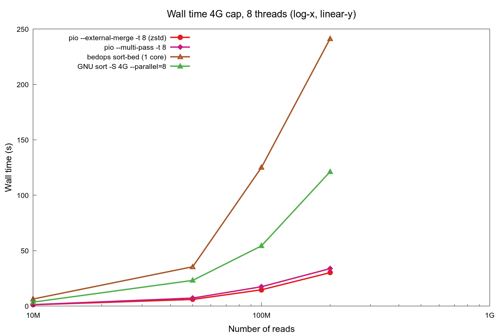
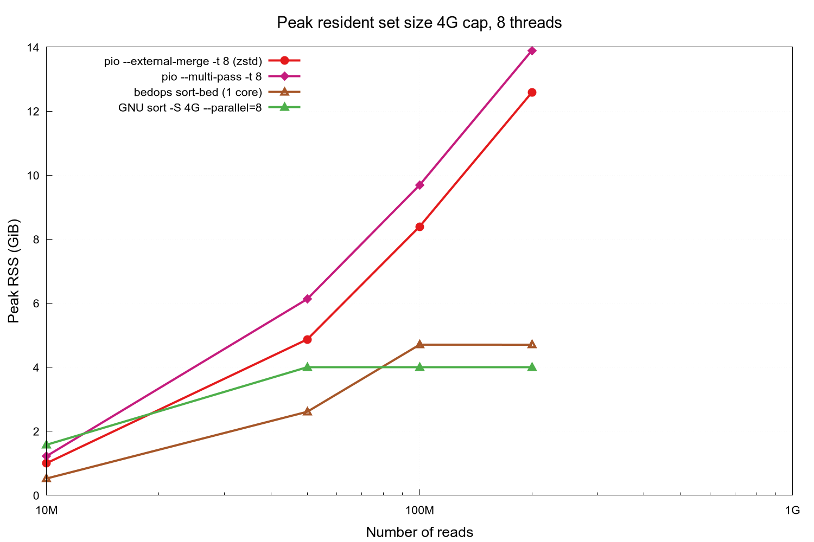
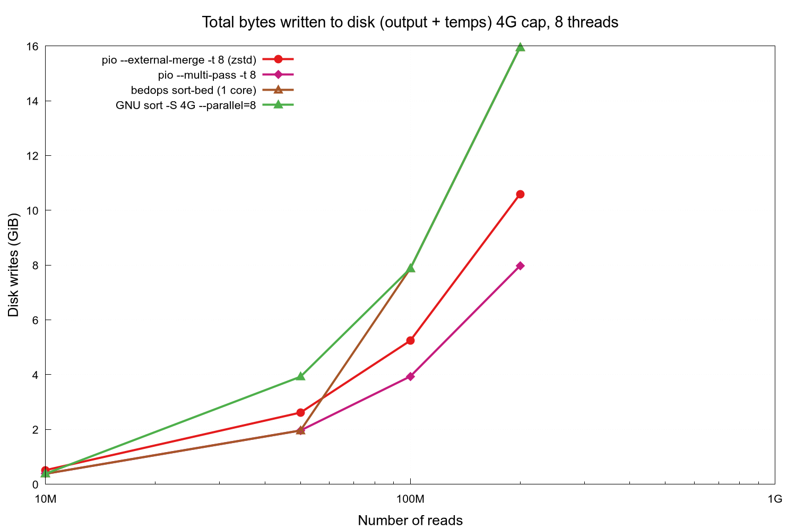
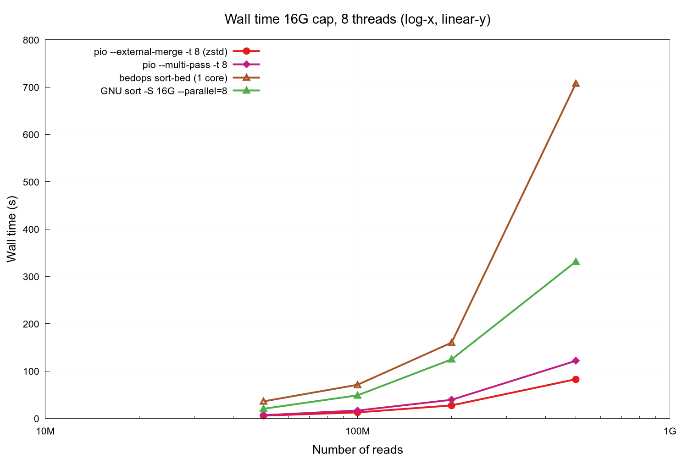
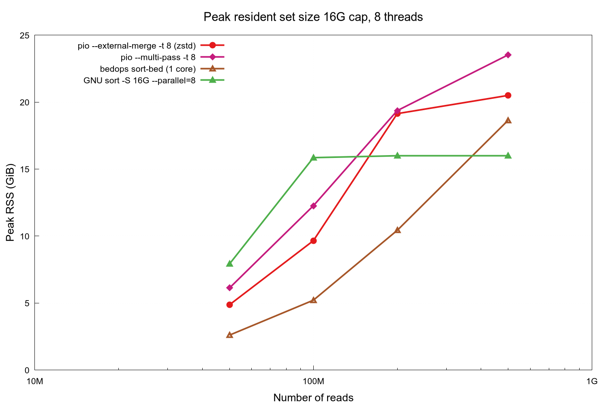
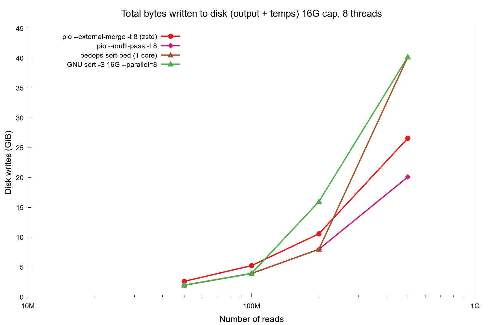
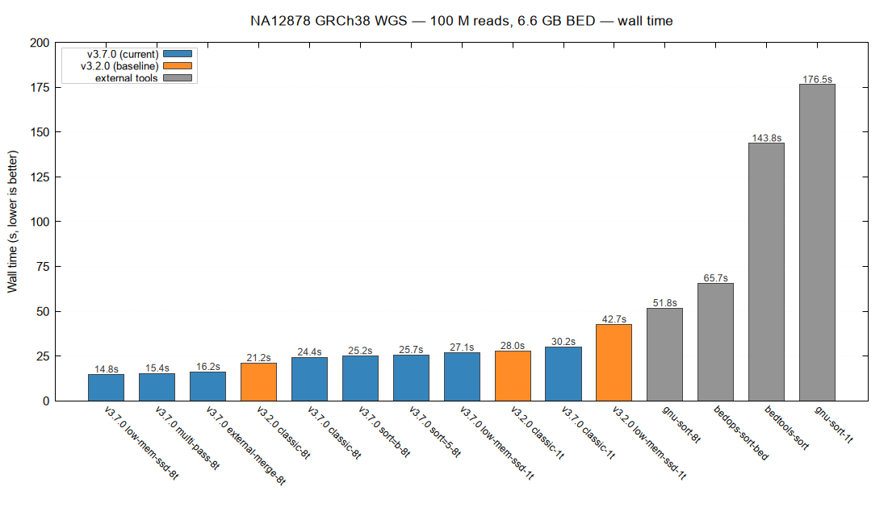
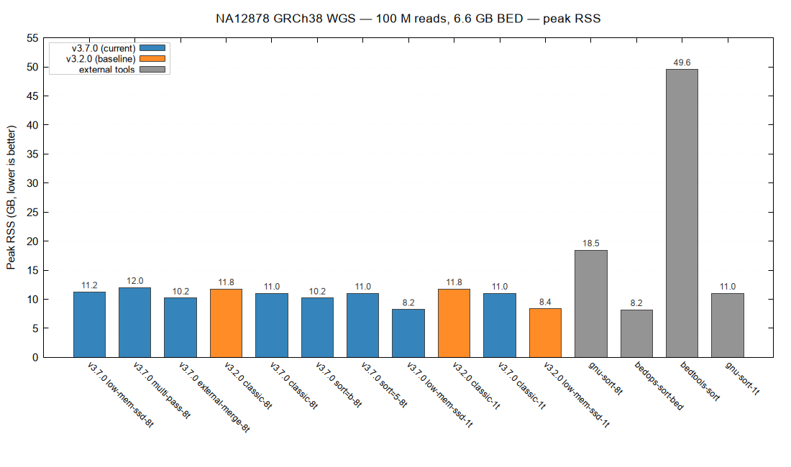

# pioSortBed

[](https://github.com/balwierz/pioSortBed/actions/workflows/ci.yml)

**Ultra-fast BED file sorter for genomics**

Sorts BED files by chromosome and start coordinate, equivalent to:
```
LC_ALL=C sort -k1,1 -k2,2n file.bed
```
but significantly faster on large datasets. Supports BED3, BED6, and extended BED formats.

## Sort modes

pioSortBed exposes **four sort paths**, all driven by the same parallel
mmap-chunked parser and the same LSD radix sort kernel
(`radixSort64`, an 8-pass 8-bit radix on packed `(chrIdx, pos)` 64-bit
keys). The paths differ in how they hold per-record state, where they
emit, and whether they write any temp files. Pick by the input size
relative to your RAM and how much you care about SSD wear:

### Which mode should I use?

| Input size vs RAM | SSD wear matters? | Use | Why |
|---|---|---|---|
| Anything ≤ ~1 M reads | — | **default (classic)** | Lowest constant factor; two-pass overhead doesn't pay off below ~1 M. |
| 1 M – RAM-sized | no | **`--low-mem-ssd -t 8`** | **Fastest path on real-world multi-chromosome BED.** Per-chromosome parallel emit beats the classic monolithic sort. |
| 1× – 5× RAM | yes (re-sort weekly+) | **`--multi-pass -t 8`** | **Zero temp-file writes** — only the unavoidable output file. 2–3× slower than `--external-merge` but 0 NAND wear beyond the result. |
| 1× – 5× RAM | no | **`--external-merge -t 8`** | Fast streaming sort with compressed (zstd) temp runs. ~30 % wear overhead. |
| ≫ RAM | — | **`--external-merge -t 8 --max-mem=...`** | Only the streaming paths handle inputs that don't fit; external-merge scales asymptotically faster than multi-pass once K > ~5 groups. |

> Recipe in one line: try `--low-mem-ssd -t 8` first; switch to
> `--multi-pass -t 8 --max-mem=4G` if your input exceeds RAM or you're
> sort-bound on a consumer SSD; switch to `--external-merge -t 8` if
> multi-pass is too slow on your input.

### Mode descriptions

- **Classic path (default).** Holds the whole input in a 24-byte
  `seqread[]` array (`int beg`, `int end`, union with `next`/`chrIdx`,
  `uint16_t lineLen`, `char str`) and runs `radixSort64` on indices
  packed as `(chrIdx << 32) | pos`. Falls back to comparator
  `std::sort` only below ~3 M reads where the radix overhead dominates.
  At `-t > 1` the radix builds per-thread digit histograms in parallel
  and scatters into disjoint output ranges (no atomics). Emits zero-copy
  from the mmap'd input buffer via `fwrite_unlocked(line, 1, lineLen,
  stdout)`. **Best for:** anything that fits in RAM with comfortable
  headroom and where you want the lowest possible constant factor.

- **`--low-mem-ssd`.** Two-pass design. Pass 1 walks the mmap once and
  builds a 16-byte-per-read table (`size_t off; uint32_t next; uint32_t
  lineLen`) with per-chromosome linked lists. Pass 2 processes each
  chromosome independently: small per-chrom `radixSort64` on a 32-bit
  position key (chromosome-index drops out of the key — chromosomes
  sort independently), then emit lines zero-copy from the mmap. Both
  passes parallelise; chromosomes flow through a producer-consumer
  barrier so output is in the user's chosen chromosome order. Peak RAM
  is dominated by the mmap'd input plus 16 B/read; chromosome length
  is irrelevant. **Best for:** ≥ ~1 M-read BEDs on SSD-backed systems
  — at NA12878 scale (100M reads, 24 chromosomes) this is the
  fastest path of all four (14.8 s vs 24.4 s for classic).

- **`--external-merge`.** Bounded-RAM streaming sort. Pass 1 reads the
  input in parallel chunks, fills an in-RAM run buffer up to
  `--max-mem` (default 1 GiB), sorts the run with `radixSort64`, and
  writes a **compressed** binary run file (default `zstd` codec, also
  `lz4` or `raw`; `WITH_BAM` builds add htscodecs' SIMD-vectorised
  rANS). Pass 2 is a k-way min-heap merge over all run files. Peak
  RSS is bounded by `--max-mem` regardless of input size. zstd is the
  default because it's faster *end-to-end* than uncompressed at scale
  — the I/O saved by compression exceeds the codec CPU cost.
  **Best for:** input genuinely exceeds RAM, or you want a fixed RAM
  budget regardless of input size.

- **`--multi-pass`.** K-pass scan with **zero temp-file writes**.
  Pass 1 builds a histogram keyed by `(chrIdx, beg >> 20)` (1 MiB
  position quantum) and bin-packs into K consecutive groups each
  ≤ `--max-mem`. Passes 2..K+1 re-stream the input, filter to one
  group, sort + emit. Total writes = output size only (no temps);
  total reads = (K+1) × input size. **Best for:** input is 1×–5× RAM
  and SSD endurance matters more than the 2–3× wall-time penalty over
  `--external-merge`. A pipeline that re-sorts a 500M-record BED
  weekly costs ~3.4 TBW/year on `--external-merge`, ~10.5 TBW/year on
  GNU sort or bedops, and **0 TBW/year on `--multi-pass`**.

### Compatibility matrix

| Sort mode \ Feature | `--sort=s` (default) | `--sort=b` | `--sort=5` | `--collapse` | stdin / `.gz` | `--lociss-output` |
|---|:-:|:-:|:-:|:-:|:-:|:-:|
| classic (default) | ✅ | ✅ | ✅ | ✅ | ✅ | ✅ |
| `--low-mem-ssd`   | ✅ | ✅ | ✅ | ✅ | — | ✅ |
| `--external-merge`| ✅ | — | — | — | — | ✅ |
| `--multi-pass`    | ✅ | — | — | — | — | ✅ |

Stdin and `.gz` inputs are slurped into memory first by the in-RAM paths;
the streaming paths require a seekable mmap'd file. The `--sort=b`
(start + end) and `--sort=5` (5'-end, strand-aware) orders require the
in-RAM paths because the streaming-path run-file format only encodes
the start-coordinate key.

### Parallel parsing

All four paths share the same parallel mmap-chunked parser: the input
is split into newline-aligned chunks, each chunk is parsed by a worker
thread into per-chromosome partial linked lists with global indices,
and a final serial step concatenates the per-chunk lists into a single
per-chromosome map (no rebase pass). At `-t 1` this short-circuits to
a serial parser to avoid the per-chunk bookkeeping cost. Stdin / `.gz`
input is slurped into one buffer up front and parsed through the same
machinery.

## LociSSD Parquet output

`--lociss-output FILE` writes a sorted **Apache Parquet** file conforming
to the LociSSD v2 spec ([`FORMAT_SPEC.md`](FORMAT_SPEC.md)) instead of
(or alongside) BED text. The file contains four required columns
— `Chromosome`, `Start`, `End`, and a derived `MaxEndSoFar`
(per-chromosome running max of `End`) — plus a JSON manifest in the
Parquet footer KV metadata.

The format is **natively consumable by every Parquet-aware reader**
with no glue:

```python
# polars
import polars as pl
df = pl.read_parquet("regions.lociss")

# DuckDB
import duckdb
duckdb.sql("SELECT * FROM 'regions.lociss' "
           "WHERE Chromosome = 'chr1' AND Start < 100000 AND MaxEndSoFar > 50000")

# pyranges 1
import pyranges as pr
gr = pr.read_table("regions.lociss")
```

The `MaxEndSoFar` column makes the file **self-indexing for region
queries**: a reader can prune row groups via Parquet's min/max
statistics without a separate index scan. The optional `--lociss-index`
flag additionally embeds a row-precision interval index in the footer
KV (Arrow IPC stream, zstd-compressed) for fine-grained pruning at
the cost of ~24 B/record transient RAM during sort.

`--lociss-output` works on **every sort path** (classic, `--low-mem-ssd`,
`--multi-pass`, `--external-merge`); only the corresponding sort-mode
restrictions apply (`--sort=b|5` not yet supported with LociSSD
output). `--collapse` pairs with `--lociss-output` on the classic sort
path and writes a five-column `{Chr, Start, End, Score double,
MaxEndSoFar}` schema per FORMAT_SPEC §10. Build with
`make WITH_LOCISS=1` (requires `libarrow-dev` + `libparquet-dev`); the
default build has zero Arrow / Parquet dependency.

### Schema by input flavor

pioSortBed detects the BED variant from the first record's column
count and locks the LociSSD schema for the whole file. Standard
flavors (BED4 / BED5 / BED6 / BED12) get **typed columns** so
downstream readers can push predicates onto `Strand` etc. Anything
else — narrowPeak's 10 cols, methylation tracks with extra signal
columns, custom 7/8-col formats — falls back to a single catch-all
`Tail` string column that preserves the raw bytes verbatim.

| Input | Schema (in file order, per FORMAT_SPEC §3.3) |
|---|---|
| BED3                  | `Chromosome, Start, End, MaxEndSoFar` |
| BED4                  | `Chromosome, Start, End, Name, MaxEndSoFar` |
| BED5                  | `Chromosome, Start, End, Name, Score, MaxEndSoFar` |
| BED6                  | `Chromosome, Start, End, Strand, Name, Score, MaxEndSoFar` |
| BED12                 | `Chromosome, Start, End, Strand, Name, Score, ThickStart, ThickEnd, ItemRgb, BlockCount, BlockSizes, BlockStarts, MaxEndSoFar` |
| Other (7/8/9/10/11/13+) | `Chromosome, Start, End, Tail, MaxEndSoFar` (catch-all) |

Notes:

- **`Strand` is pulled to position 4** for BED6 and BED12, per
  FORMAT_SPEC §3.3 (loci-required columns, then Strand if present,
  then the remaining user columns in BED order, then `MaxEndSoFar`).
- **`Score` is `string`, not numeric.** BED scores can be non-numeric
  (e.g. `.`); the spec defers integer interpretation to the reader.
- **`ThickStart`, `ThickEnd`, `BlockCount` are `int32`.** A non-integer
  in any of these for a BED12 input is an error at sort time.
- **Catch-all (BED_PLUS) input** behaves as in earlier versions:
  arbitrary tail content round-trips into the `Tail` string; column
  counts can even vary record-to-record (one row 7 cols, another 9
  cols — `Tail` is just different strings); only the choice between
  BED3 and BED4+ at the first record is sticky for the whole file.
- **Mixing BED3 and BED4+ records is rejected.** Parquet can't
  evolve schemas mid-write, so once the first record commits to a
  flavor, later records must match. The error message points at the
  fix: split the input by column count, or pad short records with
  a placeholder column (e.g. `awk -F'\t' 'NF==3{$0=$0"\t."} 1'`).

## Installation

**Dependencies:** GCC ≥ 9 (C++17), oneTBB, liblz4, libzstd
(`apt install libtbb-dev liblz4-dev libzstd-dev` on Debian/Ubuntu).
CLI11 is bundled in this repo.

```bash
make
make test       # optional: runs the test suite (25 checks)
make install    # optional: installs to /usr/local/bin (override PREFIX=...)
```

**Optional builds:**

- `make WITH_HTSLIB=1` enables the `--bgzip` / `--tabix` integrated
  output (write a queryable `.bed.gz` + `.tbi` in one invocation;
  no need for the canonical `pio | bgzip ; tabix` three-tool
  pipeline). Uses the system htslib install (`apt install libhts-dev`);
  pass `HTSLIB=/path/to/source-tree` to link against an htslib source
  tree instead.
- `make WITH_BAM=1 HTSLIB=/path/to/htslib` (implies `WITH_HTSLIB=1`)
  adds an in-RAM BAM input path (coord-sort only; reuses `radixSort64`
  and writes BAM via htslib).
- `make WITH_RANS=1 HTSLIB=/path/to/htslib` (implies `WITH_HTSLIB=1`)
  enables htscodecs' SIMD-vectorised rANS order-0/1 codecs for
  `--external-merge` temp files. Requires an htslib source tree
  (the htscodecs/ headers don't ship in distro packages).
- `make WITH_LOCISS=1` enables the `--lociss-output` Parquet writer.
  Requires `libarrow-dev libparquet-dev`. The default build has zero
  Arrow/Parquet dependency.

Manual compilation (default build):
```bash
g++ src/pioSortBed.cpp -Isrc -o pioSortBed -O3 -std=c++20 \
    -static-libstdc++ -static-libgcc -ltbb -llz4 -lzstd \
    -DVERSION_STRING=\"3.8.0\"
```

> Parallelism uses C++20 `std::execution::par` algorithms backed by oneTBB,
> not OpenMP. The C++ runtime is linked statically; libtbb / lz4 / zstd
> stay dynamic in the default `make`. The release binary
> (`make release-binary TBB_LIB=...`) statically links all of libtbb,
> lz4, and zstd to produce a self-contained `pioSortBed-linux-x86_64`.

## Usage

```
pioSortBed [options] <input.bed>
pioSortBed [options] -   # read from standard input
```

| Option | Description |
|--------|-------------|
| **Sort key** | |
| `-s s` / `--sort s` | Sort by start coordinate (default) |
| `-s b` / `--sort b` | Sort by start and end coordinate (classic / low-mem-ssd only) |
| `-s 5` / `--sort 5` | Sort by 5' end, strand-aware (classic / low-mem-ssd only) |
| `-n` / `--natural-sort` | Natural chromosome order: `chr2 < chr10` (default: lexicographic) |
| **Sort path** (see [Sort modes](#sort-modes) for which to pick) | |
| *(no flag)* | Classic in-RAM `radixSort64` path (default) |
| `--low-mem-ssd` | Two-pass mode — fastest path at ≥ 1 M reads on SSD-backed systems |
| `--external-merge` | Streaming sort with compressed (zstd) temp files. Use for inputs > RAM |
| `--multi-pass` | K-pass scan, **zero temp-file writes**. SSD-wear-friendly fallback |
| **Memory / threading / I/O** | |
| `-t N` / `--threads N` | Number of threads (0 = all cores; 1 = single-threaded) |
| `--max-mem=N[GMK]` | RAM cap. For `--low-mem-ssd`: parallel pass-2 emit budget (default uncapped). For `--external-merge`: per-run buffer (default 1 GiB). For `--multi-pass`: per-group budget. |
| `--merge-codec raw\|lz4\|zstd` | Temp-file compression for `--external-merge` (default: `zstd`). With `WITH_BAM=1`: also `rans0`, `rans1`. |
| `--tmpdir DIR` | Temp directory for `--external-merge` runs (default: `$TMPDIR` or `/tmp`) |
| `-o FILE` / `--output FILE` | Write to file instead of stdout |
| **Other** | |
| `--collapse` | Collapse records sharing `(chr, start)` by summing their score column. Text output: classic / `--low-mem-ssd`. Parquet output (`--lociss-output`): classic only — writes a 5-column `{Chr, Start, End, Score double, MaxEndSoFar}` schema per FORMAT_SPEC §10. Not compatible with `--sort=b\|5`, `--external-merge`, `--multi-pass`. |
| `--bgzip` | Write BGZF-compressed BED text (`.bed.gz`) instead of plain text. Requires `-o FILE`. Mutually exclusive with `--lociss-output`. Requires `make WITH_HTSLIB=1`. |
| `--tabix` | After `--bgzip`, build a tabix `.tbi` index in place. Implies `--bgzip`. Replaces the canonical `pio \| bgzip ; tabix` three-tool pipeline. |
| `--lociss-output FILE` | Write sorted Parquet (LociSSD v2 spec) instead of BED text. Works on every sort path. Requires `make WITH_LOCISS=1`. See [LociSSD Parquet output](#lociss-parquet-output). |
| `--lociss-index` | Embed an optional row-precision interval index in the LociSSD output footer |
| `-v` / `--verbose` | Print parsing / sorting timing and chromosome stats to stderr |
| `-V` / `--version` | Print version and exit |
| `-h` / `--help` | Show help message |

BED header lines (`track`, `browser`, `#` comments) are passed through unchanged to output. Gzip-compressed input (`.gz` extension) is transparently decompressed.

**Examples:**
```bash
# Common cases
pioSortBed input.bed > sorted.bed                      # small file
pioSortBed --low-mem-ssd -t 8 input.bed > sorted.bed   # ≥ 1 M reads, RAM-fits — recommended
pioSortBed input.bed.gz > sorted.bed                   # gzip input
cat input.bed | pioSortBed - > sorted.bed              # stdin
pioSortBed --sort b input.bed > sorted.bed             # tie-break by end coord
pioSortBed --natural-sort input.bed > sorted.bed       # chr2 before chr10

# Streaming sorts (input ≫ RAM, or wear-sensitive workflow)
pioSortBed --external-merge -t 8 --max-mem=4G huge.bed > sorted.bed
pioSortBed --multi-pass     -t 8 --max-mem=4G huge.bed > sorted.bed   # 0 temp writes

# Integrated bgzip + tabix in one step (requires WITH_HTSLIB=1)
# Replaces the canonical:   pio | bgzip > out.bed.gz; tabix out.bed.gz
pioSortBed --low-mem-ssd -t 8 --bgzip --tabix -o sorted.bed.gz input.bed

# LociSSD Parquet output (requires WITH_LOCISS=1)
pioSortBed --low-mem-ssd -t 8 --lociss-output sorted.lociss input.bed
pioSortBed --low-mem-ssd -t 8 --lociss-output sorted.lociss --lociss-index input.bed
```

## Benchmark Results

Comprehensive sorting benchmark on realistic BED6 files (10 chromosomes, coordinates 0–249 Mbp). All tools verified to produce identical sort order.

### System Configuration

**Hardware:** Lenovo ThinkPad P1 Gen7
- CPU: Intel Core Ultra 7 155H (Meteor Lake, Intel 4) — 16 cores / 22 threads: 6 P-cores (Redwood Cove, up to 4.8 GHz) + 8 E-cores (Crestmont, up to 3.8 GHz) + 2 LP E-cores (Crestmont, up to 2.5 GHz)
- RAM: 32 GB LPCAMM2 @ 7467 MT/s
- SSD: KIOXIA KXG8AZNV1T02 NVMe — random 4 kB read: 177 MiB/s, 45.3k IOPS (fio: `--rw=randread --bs=4k --size=1G --numjobs=4 --runtime=30`)

**Tools & Command Lines:**

| Tool | Version | Command |
|------|---------|---------|
| **pioSortBed** | 3.0.8 | `pioSortBed -t 1 input.bed` (single-thread) |
| **pioSortBed** | 3.0.8 | `pioSortBed -t 4 input.bed` (4 threads) |
| **pioSortBed** | 3.0.8 | `pioSortBed -t 8 input.bed` (8 threads) |
| **pioSortBed** (low-mem) | 3.0.8 | `pioSortBed --low-mem-ssd -t 1 input.bed` (single-thread) |
| **pioSortBed** (low-mem) | 3.0.8 | `pioSortBed --low-mem-ssd -t 4 input.bed` (4 threads) |
| **pioSortBed** (low-mem) | 3.0.8 | `pioSortBed --low-mem-ssd -t 8 input.bed` (8 threads, recommended fast path) |
| **GNU sort** | 9.10 | `LC_ALL=C sort -k1,1 -k2,2n input.bed` (single-thread) |
| **GNU sort** | 9.10 | `LC_ALL=C sort -k1,1 -k2,2n --parallel=4 input.bed` (4 threads) |
| **GNU sort** | 9.10 | `LC_ALL=C sort -k1,1 -k2,2n --parallel=8 input.bed` (8 threads) |
| **bedtools** | 2.31.1 | `bedtools sort -i input.bed` |
| **bedops sort-bed** | 2.4.42 | `sort-bed input.bed` |

Wall time and peak RSS (resident set size) measured with GNU time. Times in seconds or milliseconds; memory in MB or GB.


### Wall Time


#### Legend (colour & line style):

Same colour per tool family; thread count distinguished by line style (`-t 1` solid, `-t 4` dashed, `-t 8` dotted). pioSortBed classic and pioSortBed low-mem are different *algorithms* and get different colours. bedtools and bedops are single-threaded by design.

| Tool                | Colour     | Marker | Line   | Description |
|---------------------|------------|--------|--------|-------------|
| **pioSortBed 1t**       | <span style="color:#e41a1c">████</span> | ● | solid   | Classic path, single-thread |
| **pioSortBed 4t**       | <span style="color:#e41a1c">████</span> | ● | dashed  | Classic path, 4 threads |
| **pioSortBed 8t**       | <span style="color:#e41a1c">████</span> | ● | dotted  | Classic path, 8 threads |
| **pioSortBed low-mem 1t** | <span style="color:#c51b7d">████</span> | ◆ | solid   | Low-memory SSD mode, single-thread |
| **pioSortBed low-mem 4t** | <span style="color:#c51b7d">████</span> | ◆ | dashed  | Low-memory SSD mode, 4 threads |
| **pioSortBed low-mem 8t** | <span style="color:#c51b7d">████</span> | ◆ | dotted  | Low-memory SSD mode, 8 threads (recommended fast path) |
| **GNU sort 1t**         | <span style="color:#4daf4a">████</span> | ▲ | solid   | Single-thread |
| **GNU sort 4t**         | <span style="color:#4daf4a">████</span> | ▲ | dashed  | 4 threads |
| **GNU sort 8t**         | <span style="color:#4daf4a">████</span> | ▲ | dotted  | 8 threads |
| **bedtools**            | <span style="color:#984ea3">████</span> | ✚ | solid   | bedtools sort |
| **bedops**              | <span style="color:#a65628">████</span> | ✦ | solid   | bedops sort-bed |

| Reads | pio 1t | pio 4t | pio 8t | pio lm 1t | pio lm 4t | pio lm 8t | sort 1t   | sort 4t  | sort 8t   | bedtools | bedops    |
|------:|-------:|-------:|-------:|----------:|----------:|----------:|----------:|---------:|----------:|---------:|----------:|
| 10k   | 0 ms   | 0 ms   | 0 ms   | 0 ms      | 0 ms      | 0 ms      | 0 ms      | 10 ms    | 0 ms      | 10 ms    | 0 ms      |
| 20k   | 0 ms   | 0 ms   | 0 ms   | 0 ms      | 0 ms      | 0 ms      | 10 ms     | 10 ms    | 10 ms     | 20 ms    | 10 ms     |
| 50k   | 10 ms  | 0 ms   | 0 ms   | 10 ms     | 0 ms      | 0 ms      | 30 ms     | 30 ms    | 30 ms     | 40 ms    | 30 ms     |
| 100k  | 10 ms  | 10 ms  | 10 ms  | 10 ms     | 10 ms     | 10 ms     | 70 ms     | 70 ms    | 70 ms     | 80 ms    | 50 ms     |
| 200k  | 30 ms  | 30 ms  | 20 ms  | 30 ms     | 20 ms     | 20 ms     | 150 ms    | 90 ms    | 90 ms     | 180 ms   | 120 ms    |
| 500k  | 100 ms | 70 ms  | 70 ms  | 90 ms     | **40 ms** | **40 ms** | 410 ms    | 170 ms   | 170 ms    | 450 ms   | 300 ms    |
| 1M    | 210 ms | 180 ms | 170 ms | 180 ms    | 130 ms    | **70 ms** | 880 ms    | 360 ms   | 310 ms    | 900 ms   | 630 ms    |
| 2M    | 430 ms | 410 ms | 380 ms | 360 ms    | 210 ms    | **150 ms**| 1900 ms   | 730 ms   | 600 ms    | 1900 ms  | 1290 ms   |
| 5M    | 1130 ms| 920 ms | 900 ms | 930 ms    | 590 ms    | **350 ms**| 5210 ms   | 2030 ms  | 1690 ms   | 4690 ms  | 3330 ms   |
| 10M   | 2280 ms| 1810 ms| 1830 ms| 1950 ms   | 1020 ms   | **690 ms**| 11.32 s   | 4370 ms  | 3470 ms   | 9600 ms  | 6770 ms   |
| 20M   | 4670 ms| 3690 ms| 3660 ms| 3900 ms   | 2710 ms   | **1330 ms**| 24.44 s  | 9220 ms  | 7270 ms   | 20.03 s  | 13.80 s   |
| 50M   | 21.51 s| 15.52 s| 5960 ms| 10.17 s   | 5300 ms   | **3310 ms**| 1min07.5s| 24.74 s  | 19.70 s   | 53.35 s  | 34.23 s   |
| 100M  | 38.56 s| —      | —      | 20.31 s   | 11.49 s   | **7230 ms**| 2min25.5s| 53.14 s  | 51.00 s   | —        | 1min07.9s |
| 200M  | 1min11s| —      | —      | 42.72 s   | 23.59 s   | **19.02 s**| 5min25.4s| 2min06.5s| 1min47.8s | —        | 2min32.9s |

> Sub-50 ms timings (10k–50k) bottom out at GNU `time`'s 10 ms resolution; raw 0 ms readings just mean the tool finished faster than the timer can resolve.
>
> `bedtools` is skipped at 100M+ because it would exceed the 30 GB RAM available on this hardware (its memory grows linearly with the input). `pio` classic `-t 4` / `-t 8` data at ≥ 100M predates v3.2.0 (which removed the bucket-sort path); the classic path now uses `radixSort64` and is RAM-efficient at every size, but those rows in the historical table reflect the old behaviour. Use `pioSortBed --low-mem-ssd -t 4` or `-t 8` at those sizes.

**Key observations:**
- **`pioSortBed --low-mem-ssd -t 8` is the fastest configuration at every size
  from 500k upwards.** Both passes are parallelised; the per-line index is a
  16-byte flat node table; pass-2 output is written through a pre-sized
  chunked buffer. At 200M reads (8.6 GB BED file), it's **19.0 s — 5.7× faster
  than GNU sort 8t, 8.0× over bedops, 17.1× over GNU sort 1t**.
- **`pioSortBed --low-mem-ssd -t 4` is a sweet spot between memory and speed.**
  At 200M it's **23.6 s / 15.2 GB**: ~25% slower than `-t 8` but uses ~17%
  less RAM, and still 4.5× faster than GNU sort 8t.
- **`pioSortBed --low-mem-ssd -t 1` beats `pioSortBed -t 1` from 5M upwards**
  (50M: 10.2 s vs 21.5 s — 2.1× faster) and uses ~30% less memory (50M: 2.9 GB
  vs 4.1 GB). At small sizes the two-pass overhead makes the regular path
  marginally faster, but the low-mem path scales much better.
- **`pioSortBed 1t`** (with the LSD radix sort) beats GNU sort 1t by 3–4× across
  the whole range and stays competitive with GNU sort 8t up through 2M.
- **`bedops sort-bed`** remains the closest single-threaded competitor and uses
  the least memory of any tool tested at small sizes.
- The classic path's `pio -t N` numbers above at 50M reads were collected
  on v3.0.8 when bucket sort was the default. v3.2.0 removed bucket sort
  entirely; the classic path now uses `radixSort64` at every size and is
  RAM-bounded by `seqread[]` + the mmap'd input. `--low-mem-ssd -t 8` is
  faster than either at 50M and above.

### Peak Memory (RSS)


| Reads | pio 1t  | pio 4t   | pio 8t      | pio lm 1t  | pio lm 4t | pio lm 8t | sort 1t  | sort 4t  | sort 8t | bedtools | bedops   |
|------:|--------:|---------:|------------:|-----------:|----------:|----------:|---------:|---------:|--------:|---------:|---------:|
| 10k   | 6.7 MB  | 6.6 MB   | 6.9 MB      | 6.5 MB     | 6.8 MB    | 6.6 MB    | 3.2 MB   | 3.0 MB   | 3.3 MB  | 8.7 MB   | 2.0 MB   |
| 20k   | 7.5 MB  | 8.0 MB   | 7.5 MB      | 7.4 MB     | 7.8 MB    | 7.9 MB    | 3.3 MB   | 3.3 MB   | 3.4 MB  | 12.5 MB  | 2.3 MB   |
| 50k   | 10.5 MB | 11.0 MB  | 11.0 MB     | 10.0 MB    | 11.6 MB   | 12.1 MB   | 5.9 MB   | 5.4 MB   | 5.8 MB  | 24.3 MB  | 4.1 MB   |
| 100k  | 15.6 MB | 16.0 MB  | 16.4 MB     | 14.7 MB    | 17.5 MB   | 18.0 MB   | 9.7 MB   | 10.0 MB  | 9.9 MB  | 44.2 MB  | 6.8 MB   |
| 200k  | 26.1 MB | 26.9 MB  | 26.9 MB     | 24.2 MB    | 28.6 MB   | 30.7 MB   | 18.5 MB  | 21.0 MB  | 21.3 MB | 84.0 MB  | 12.0 MB  |
| 500k  | 47.8 MB | 48.5 MB  | 47.7 MB     | 41.4 MB    | 54.6 MB   | 58.5 MB   | 43.8 MB  | 66.2 MB  | 66.1 MB | 202.6 MB | 28.1 MB  |
| 1M    | 90.3 MB | 82.7 MB  | 83.3 MB     | 70.0 MB    | 88.8 MB   | 102.9 MB  | 86.5 MB  | 131.5 MB | 161.4 MB| 401.0 MB | 54.8 MB  |
| 2M    | 176.3 MB| 146.2 MB | 146.2 MB    | 128.3 MB   | 181.0 MB  | 193.9 MB  | 172.6 MB | 263.5 MB | 323.8 MB| 797.8 MB | 108.0 MB |
| 5M    | 435.0 MB| 434.5 MB | 434.5 MB    | 301.5 MB   | 405.8 MB  | 487.2 MB  | 430.9 MB | 659.0 MB | 810.8 MB| 1.9 GB   | 268.4 MB |
| 10M   | 865.3 MB| 865.3 MB | 864.6 MB    | 590.9 MB   | 811.8 MB  | 963.7 MB  | 861.3 MB | 1.3 GB   | 1.6 GB  | 3.9 GB   | 535.3 MB |
| 20M   | 1.7 GB  | 1.7 GB   | 1.7 GB      | 1.2 GB     | 1.5 GB    | 1.9 GB    | 1.7 GB   | 2.6 GB   | 3.2 GB  | 7.8 GB   | 1.0 GB   |
| 50M   | 4.1 GB  | 7.9 GB   | **12.6 GB** | **2.9 GB** | 3.9 GB    | 4.8 GB    | 4.2 GB   | 6.5 GB   | 8.0 GB  | 19.4 GB  | 2.6 GB   |
| 100M  | 7.2 GB  | —        | —           | **5.7 GB** | 7.8 GB    | 9.0 GB    | 8.5 GB   | 13.0 GB  | 15.4 GB | —        | 5.2 GB   |
| 200M  | 13.6 GB | —        | —           | **11.5 GB**| 15.2 GB   | 18.4 GB   | 15.4 GB  | 15.4 GB  | 15.4 GB | —        | 10.4 GB  |

> The 100M / 200M `pio low-mem 4t` / `pio low-mem 8t` data above was collected with `--max-mem=4G`; uncapped (the new default in `benchmark.sh`) is ~15% faster — see the `--max-mem` sweep below for the trade-off.

**Key observations:**
- **`pioSortBed --low-mem-ssd -t 8` is the recommended fast path for files.**
  At 50M it beats `pio -t 8` by 45% on wall time AND uses ~62% less memory
  (3.31 s / 4.8 GB vs 5.96 s / 12.6 GB). At 100M and 200M it's one of only
  three pioSortBed configurations that fits in 32 GB RAM at all.
- **`pioSortBed --low-mem-ssd -t 4` is the memory/speed sweet spot.** Half
  the threads of `-t 8` but only ~25% slower on the headline 200M case
  (23.6 s vs 19.0 s) and uses ~17% less peak RAM (15.2 GB vs 18.4 GB).
- **`pioSortBed --low-mem-ssd -t 1` is the lowest-memory pioSortBed mode** —
  beats `pio -t 1` on memory at every size from 5M up (50M: 2.9 GB vs 4.1 GB,
  ~30% less) AND on wall time (50M: 10.17 s vs 21.51 s). At 200M reads it's
  the lowest-RAM pioSortBed mode at 11.5 GB.
- **Memory grows ~linearly with input for every tool.** At 200M: pio-lm 8t
  18.4 GB, pio-lm 4t 15.2 GB, pio-lm 1t 11.5 GB, GNU sort 15.4 GB, bedops
  10.4 GB. `bedtools` and `pio -t 4 / -t 8` would have needed >32 GB.
- **`bedops sort-bed`** uses the least memory throughout — a sensible choice
  on RAM-constrained systems where wall time isn't critical.
- **`pioSortBed -t N` (classic)** in the table above used the v3.0.8
  bucket sort at ≥ 50 M reads. From v3.2.0 bucket sort is gone and the
  classic path uses `radixSort64` at every size; for large inputs
  `--low-mem-ssd -t 4` or `-t 8` is strictly better on both axes anyway.

### `--max-mem` budget sweep (`pio-lm -t 4 @ 200M`)

`--max-mem` caps concurrent per-chromosome emit-buffer allocations on the
`--low-mem-ssd` parallel pass-2 path. To map out how it interacts with
`--low-mem-ssd -t 4`, here's a sweep on the 200M-row fixture varying the
budget from 256 MB to 16 GB plus an "uncapped" reference (no flag):


| `--max-mem` | Wall time | Peak RSS |
|------------:|----------:|---------:|
| 256M | 38.67 s | 14.86 GB |
| 512M | 38.10 s | 14.84 GB |
| 1G   | 39.08 s | 14.86 GB |
| 2G   | 38.54 s | 14.86 GB |
| **4G**   | **23.82 s** | 15.13 GB |
| 6G   | 23.90 s | 15.73 GB |
| 8G   | 23.88 s | 15.69 GB |
| 12G  | 24.00 s | 15.62 GB |
| 16G  | 24.08 s | 15.71 GB |
| **uncapped** | **20.16 s** | 15.71 GB |

Three regimes:

1. **Tight budget (≤2 GB): ~38 s / 14.9 GB.** Per-chromosome cost on this
   fixture is ~1.5 GB; below that, the budget gate `effCost = min(per_chrom,
   max_mem)` admits only one chromosome at a time and the `-t 4` worker pool
   sits mostly idle. Memory savings are surprisingly small (~0.6 GB vs the
   plateau) because the dominant ~15 GB is the mmap'd input + `lowMemNode`
   table + per-chrom output buffers — none of which `--max-mem` controls.
2. **Mid budget (4 – 16 GB): ~24 s / 15.5–16.1 GB.** All four worker
   threads can now run simultaneously. The mutex/condvar gate still
   serialises slightly, but the cost is small.
3. **Uncapped: 20.16 s / 15.71 GB — fastest.** When `--max-mem` isn't set,
   the gate short-circuits entirely (`maxMemBytes == 0 → effCost = 0`,
   skipping the lock/wait). 16% faster than the 4G plateau, no extra memory
   cost.

**Implication**: `--max-mem` is a safety cap, not a memory optimiser. Set
it only to *prevent* OOM on a host where the concurrent emit-buffer
backlog could otherwise blow past available RAM. On a 30 GB host with
this 200M-row fixture, the uncapped peak (15.7 GB at -t 4, 18.4 GB at
-t 8) is well within the headroom, so `benchmark.sh` runs the headline
cases uncapped.

To reproduce the sweep: `bash benchmark/bench_max_mem.sh`. Data lives in
`benchmark/maxmem_sweep.csv`; plot in `benchmark/plot_maxmem.gp`.

### External-merge / multi-pass / bedops / GNU sort comparison

Benchmark of the two pioSortBed fallback paths (`--external-merge` with
the default zstd codec, and `--multi-pass`) against `bedops sort-bed`
and `LC_ALL=C sort -k1,1 -k2,2n` on a synthetic BED6 fixture, with two
memory caps:
- **16 GiB cap**, sizes 50 M – 500 M reads. The 500 M / 21 GB case is
  the only one that exceeds the cap; smaller inputs all fit.
- **4 GiB cap**, sizes 10 M – 200 M reads. Spill is triggered for every
  tool at 100 M+ where the 4 GB input matches the cap.

All tools run with the same explicit thread count (`-t 8` for pioSortBed
and `--parallel=8` for GNU sort; `bedops sort-bed` is single-threaded
by design — the table notes that as `T=1`). Temp files go to `/var/tmp`
(ext4) so the I/O metric is real. Wall time and peak RSS via
`getrusage`; total bytes written to disk via `getrusage`
`ru_oublock × 512` (block-layer I/O including pages still dirty in cache
at process exit — the SSD-wear-relevant metric).

#### 4 GiB cap, 8 threads





| Reads | Input | Tool | T | Wall | Peak RSS | Disk writes |
|------:|------:|------|--:|-----:|---------:|------------:|
|  10 M | 0.4 GB | `pio --external-merge zstd` | 8 | 1.2 s  | 1.0 GB | 0.5 GB |
|       |        | `pio --multi-pass`          | 8 | 1.3 s  | 1.3 GB | **0.4 GB** |
|       |        | `bedops sort-bed`           | 1 | 6.4 s  | 0.5 GB | 0.4 GB |
|       |        | `GNU sort --parallel=8`     | 8 | 3.6 s  | 1.6 GB | 0.4 GB |
|  50 M | 2.0 GB | `pio --external-merge zstd` | 8 | **6.0 s** | 5.1 GB | 2.7 GB |
|       |        | `pio --multi-pass`          | 8 | 7.2 s  | 6.4 GB | **2.0 GB** |
|       |        | `bedops sort-bed`           | 1 | 35.5 s | 2.7 GB | 2.0 GB |
|       |        | `GNU sort --parallel=8`     | 8 | 23.2 s | 4.2 GB | 4.2 GB |
| 100 M | 4.0 GB | `pio --external-merge zstd` | 8 | **14.7 s** | 8.8 GB | 5.4 GB |
|       |        | `pio --multi-pass`          | 8 | 17.4 s | 10.2 GB | **4.0 GB** |
|       |        | `bedops sort-bed`           | 1 | 125 s  | 4.9 GB | 8.5 GB |
|       |        | `GNU sort --parallel=8`     | 8 | 54.4 s | 4.2 GB | 8.5 GB |
| 200 M | 8.0 GB | `pio --external-merge zstd` | 8 | **30.2 s** | 13.2 GB | 10.9 GB |
|       |        | `pio --multi-pass`          | 8 | 33.9 s | 14.6 GB | **8.2 GB** |
|       |        | `bedops sort-bed`           | 1 | 242 s  | 4.9 GB | 17.1 GB |
|       |        | `GNU sort --parallel=8`     | 8 | 121 s  | 4.2 GB | 17.1 GB |

#### 16 GiB cap, 8 threads





Refreshed under v3.7.0 (the v3.5.0 baseline is preserved as
`benchmark/bench_external_16G_t8.v3.5.0_baseline.csv`):

| Reads | Input | Tool | T | Wall | Peak RSS | Disk writes |
|------:|------:|------|--:|-----:|---------:|------------:|
|  10 M | 0.4 GB | `pio --external-merge zstd` | 8 | **1.2 s**  | 1.0 GB  | 0.5 GB |
|       |        | `pio --multi-pass`          | 8 | 1.3 s      | 1.2 GB  | **0.4 GB** |
|       |        | `bedops sort-bed`           | 1 | 6.0 s      | 0.5 GB  | 0.4 GB |
|       |        | `GNU sort --parallel=8`     | 8 | 3.7 s      | 1.6 GB  | 0.4 GB |
|  50 M | 2.0 GB | `pio --external-merge zstd` | 8 | **6.2 s**  | 5.0 GB  | 2.6 GB |
|       |        | `pio --multi-pass`          | 8 | 6.4 s      | 6.1 GB  | **2.0 GB** |
|       |        | `bedops sort-bed`           | 1 | 30.3 s     | 2.6 GB  | 2.0 GB |
|       |        | `GNU sort --parallel=8`     | 8 | 22.0 s     | 7.9 GB  | 2.0 GB |
| 100 M | 4.0 GB | `pio --external-merge zstd` | 8 | **12.2 s** | 10.1 GB | 5.2 GB |
|       |        | `pio --multi-pass`          | 8 | 12.8 s     | 12.3 GB | **3.9 GB** |
|       |        | `bedops sort-bed`           | 1 | 60.8 s     | 5.2 GB  | 3.9 GB |
|       |        | `GNU sort --parallel=8`     | 8 | 47.3 s     | 15.9 GB | 3.9 GB |
| 200 M | 8.0 GB | `pio --external-merge zstd` | 8 | **25.5 s** | 20.3 GB | 10.6 GB |
|       |        | `pio --multi-pass`          | 8 | 31.4 s     | 24.7 GB | **8.0 GB** |
|       |        | `bedops sort-bed`           | 1 | 125 s      | 10.4 GB | 8.0 GB |
|       |        | `GNU sort --parallel=8`     | 8 | 114 s      | 16.0 GB | 16.0 GB |
| 500 M | 21.6 GB | `pio --external-merge zstd`| 8 | **66.8 s** | 39.3 GB | 26.6 GB |
|       |        | `pio --multi-pass`          | 8 | 80.4 s     | 42.6 GB | **20.1 GB** |
|       |        | `bedops sort-bed`           | 1 | 506 s      | 18.6 GB | 40.3 GB |
|       |        | `GNU sort --parallel=8`     | 8 | 313 s      | 16.0 GB | 40.3 GB |

At the 500 M / 21 GB / 16 GiB-cap case (input ≫ cap, all tools spill or
multi-pass): **`pio --external-merge -t 8` is 4.7× faster than GNU sort
and 7.6× faster than bedops**, while `pio --multi-pass -t 8` writes
**50 % less** than either alternative (20.1 GB vs 40.3 GB). Compared to
the v3.5.0 baseline, v3.7.0 cut extmerge's 500M wall time by 19 %
(82.9 → 66.8 s) and multi-pass's by 34 % (121.9 → 80.4 s) thanks to
threading `numThreads` through `radixSort64` in each run.

**Key findings (4 GiB cap, 8 threads):**

- **`pio --external-merge -t 8`** is the **fastest** at every size:
  4–7× faster than bedops (single-threaded by design) and 3–4× faster
  than `GNU sort --parallel=8`. Its zstd-compressed temp runs cost a
  ~30 % write overhead vs. multi-pass (zstd packs the binary records
  to ~0.45× of input size) but it scales asymptotically as input ≫
  cap.
- **`pio --multi-pass -t 8`** writes the **least** at every size, by
  design (zero temp files; writes = output bytes only). At
  200 M / 4 GiB cap (input 2× cap) it writes 8.2 GB vs 17.1 GB for
  bedops and GNU sort — **52 % less NAND wear** — and is still the
  second-fastest tool at this scale, only ~12 % slower than
  `--external-merge`.
- **`bedops sort-bed`** is single-threaded; it is consistently 4–8×
  slower than the parallel pio paths at sizes ≥ 50 M. Lowest peak RSS
  among the four (~5 GB at 200 M).
- **`GNU sort --parallel=8`** is the parallel pio paths' closest
  competitor on wall time but writes 2× more than `--multi-pass`
  whenever it spills (every 100 M+ run at 4 GiB cap).

To reproduce:
```bash
bash benchmark/bench_external.sh "10000000 50000000 100000000 200000000" 4G /var/tmp 8
bash benchmark/bench_external.sh "50000000 100000000 200000000 500000000" 16G /var/tmp 8
```
Data: `benchmark/bench_external_4G_t8.csv` /
`bench_external_16G_t8.csv`. Plots via
`gnuplot -e "BUDGET='4G';THREADS=8" benchmark/plot_external.gp` (or
`'16G'`). The 500 M / 16 GiB run takes ~25 minutes total (down from
~70 minutes in v3.4.0; v3.5.0's parallel parsing + GNU sort's
`--parallel=8` both cut their respective costs ~3–11×).

### Performance Summary

For a one-line answer: see the [Which mode should I use?](#which-mode-should-i-use)
table at the top of the *Sort modes* section. The benchmarks above
support that recipe with concrete numbers across the four pioSortBed
paths plus GNU sort, bedops, and bedtools.

Headline numbers from the real-data NA12878 100M-read benchmark below
(6.6 GB BED, 24 chromosomes, all paths at `-t 8`):

| Mode | Wall | vs GNU sort -1t |
|---|---:|---:|
| `--low-mem-ssd` | **14.8 s** | 11.9× |
| `--multi-pass` | 15.4 s | 11.5× |
| `--external-merge` | 16.2 s | 10.9× |
| classic (default) | 24.4 s | 7.2× |
| GNU sort `--parallel=8` | 51.8 s | 3.4× |
| bedops sort-bed | 65.7 s | 2.7× |
| bedtools sort | 144 s | 1.2× |
| `LC_ALL=C sort -k1,1 -k2,2n` | 176 s | 1.0× |

To reproduce the synthetic sweep: `bash benchmark/benchmark.sh`
(requires GNU time; gnuplot for plots; `TMPDIR=/var/tmp` recommended
for the 100 M+ sizes — GNU sort spill files plus the 8.6 GB 200 M-row
fixture exceed a 16 GB tmpfs). For the real-data benchmark:
`bash benchmark/benchmark_na12878.sh all100M`.

### Real-data Benchmark: NA12878 WGS (chr20, 120M reads)

Benchmark on real Illumina WGS reads: NA12878 (HG001) 300x HiSeq, chr20, aligned to GRCh38 (GIAB/NHGRI). 120,499,538 reads, 7.9 GB BED file.

| Tool | Wall time | Peak RSS |
|------|-----------|----------|
| **pioSortBed 1t** | 9.4 s | 10.8 GB |
| **pioSortBed 8t** | 9.2 s | 10.8 GB |
| **pioSortBed low-mem** | 12.0 s | 15.5 GB |
| **GNU sort 1t** | 1min 09.8s | 13.2 GB |
| **GNU sort 8t** | 33.9 s | 22.2 GB |
| **bedops sort-bed** | 59.3 s | 9.9 GB |
| **bedtools sort** | 6min 14.3s | 40.3 GB |

**pioSortBed is 7.4× faster than GNU sort (single-thread) and 3.6× faster than GNU sort (8-thread).** bedops is competitive on memory but 6.3× slower than pioSortBed. bedtools is the slowest and uses the most RAM (40.3 GB).

> The `pioSortBed low-mem` row was measured with the default thread count (= all cores on the bench box) while the other "8t" rows used `-t 8` / `--parallel=8`. The synthetic table above splits low-mem into `-t 1` and `-t 8`; this real-data table will be re-run on the next benchmark cycle.

To reproduce: `bash benchmark/benchmark_na12878.sh` (streams ~12 GB from NCBI FTP on first run).

### Real-data Benchmark: NA12878 WGS (all chromosomes, exactly 100M reads)

100,000,000 reads randomly sampled from all standard chromosomes (chr1–22, X, Y) of the same HG001 GRCh38 300x BAM. Sampled by streaming a 2% subsample (~114M reads) then `shuf -n 100000000`. Reads span all chromosomes — realistic multi-chromosome sort workload.

Re-run on v3.7.0 with all current sort modes:





| Tool / mode                      | Wall time  | Peak RSS  |
|---------------------------------:|-----------:|----------:|
| **pioSortBed `--low-mem-ssd` -t 8**  | **14.8 s** |  11.2 GB  |
| **pioSortBed `--multi-pass`   -t 8** | 15.4 s     |  12.0 GB  |
| **pioSortBed `--external-merge` -t 8** | 16.2 s   |  10.2 GB  |
| pioSortBed v3.2.0 classic -t 8   | 21.2 s     |  11.8 GB  |
| pioSortBed classic -t 8 (default)| 24.4 s     |  11.0 GB  |
| pioSortBed `--sort=b` -t 8       | 25.2 s     |  10.2 GB  |
| pioSortBed `--sort=5` -t 8       | 25.7 s     |  11.0 GB  |
| pioSortBed `--low-mem-ssd` -t 1  | 27.1 s     |   8.2 GB  |
| pioSortBed v3.2.0 classic -t 1   | 28.0 s     |  11.8 GB  |
| pioSortBed classic -t 1          | 30.2 s     |  11.0 GB  |
| pioSortBed v3.2.0 `--low-mem-ssd` -t 1 | 42.7 s |   8.4 GB  |
| GNU sort -t 8                    | 51.8 s     |  18.5 GB  |
| bedops sort-bed                  | 1min 05.7s |   8.2 GB  |
| bedtools sort                    | 2min 23.8s |  49.6 GB  |
| GNU sort -t 1                    | 2min 56.5s |  11.0 GB  |

CSV: [benchmark/benchmark_na12878_all100M.csv](benchmark/benchmark_na12878_all100M.csv); reproduce with `bash benchmark/benchmark_na12878.sh all100M`.

**`--low-mem-ssd -t 8` is now the fastest mode**, beating the classic in-RAM
sort by **9.6 s** thanks to per-chromosome parallel emit + radix sort. The
streaming modes (`--multi-pass`, `--external-merge`) are only ~0.6–1.4 s
behind it despite using strictly bounded RAM. **pioSortBed is 11.9× faster
than GNU sort -t 1 and 3.5× faster than GNU sort -t 8.** bedtools peaks
at 49.6 GB RSS — 4× the next-highest tool — and is 9.7× slower than
pioSortBed `--low-mem-ssd` -t 8.

The v3.2.0 classic-8t row (21.2 s) is faster than v3.7.0 classic-8t
(24.4 s). The lineLen-aware emit fix (commit 1ee01fb) recovered most of
that gap — clean re-runs at -t 8 are now 19.6 s vs 18.9 s for v3.2.0
(4% remaining; tracked separately).

## Limits

The v3.0.x cleanup pass made every previously-baked-in limit either dynamic
at runtime, error-on-overflow, or driven by an existing CLI flag. Current
state (also visible via `pioSortBed --help`):

| Limit | Behaviour |
|-------|-----------|
| Line length (stdin / gzip) | None — `getline()` heap buffer grows as needed |
| Line length (file mmap)    | None — `memchr` boundary, only bounded by file size |
| Chromosome name length     | None — stored as pointer+length into the line |
| Chromosome coordinate (`beg`, `end`) | Signed 32-bit ⇒ ≤ 2.15 Gbp per single coordinate |
| Read count                 | uint32_t indices ⇒ ≤ 4.29 B reads (all sort paths) |
| BED score field length (col 5) | 255 bytes; over-long values rejected with a clear error |

Above 2.15 Gbp per single coordinate, you'd need to widen `int beg, int end`
in `seqread` / `lowMemNode` to `int64_t` and rebuild. Above 4.29 B reads,
the index types in `seqread::next` / `lowMemNode::next` / `chrInfoT::lastRead`
need widening too. Both are deliberate refactors, not flag flips — but no
real-world genomic dataset has approached either limit.

## Author

Piotr Balwierz
