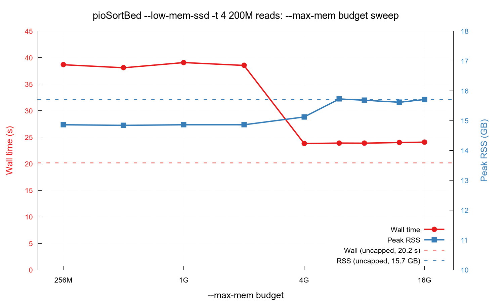

# pioSortBed

**Ultra-fast BED file sorter for genomics**

Sorts BED files by chromosome and start coordinate, equivalent to:
```
LC_ALL=C sort -k1,1 -k2,2n file.bed
```
but significantly faster on large datasets. Supports BED3, BED6, and extended BED formats.

## Algorithm

pioSortBed has two sort paths:

- **`--low-mem-ssd` — recommended for any file ≥ ~1 M reads.** A two-pass
  algorithm. Pass 1 walks the mmap'd input once and builds a 16-byte-per-
  read index table with per-chromosome linked lists. Pass 2 processes each
  chromosome independently: small per-chrom `std::sort`, then emit lines
  via mmap pointers (no copy). Both passes parallelise; chromosomes flow
  through a producer-consumer barrier so output is in alphabetical order.
  Peak RAM scales with read count (~16 B per read for the index, plus the
  mmap), not with chromosome length.

- **Classic path (the default when `--low-mem-ssd` isn't set)** holds the
  whole input in a `seqread[]` array and uses an internal hybrid:
  - `std::sort` on an index array (O(n log n)) below `--bucket-cutoff`
    reads (default 50 M).
  - Bucket / counting sort (O(n + m), where *m* = max chromosome
    coordinate) at and above the cutoff. Multi-threaded bucket sort
    allocates a per-chromosome `chromTable` slab on each worker — fast
    but RAM-hungry, and the slabs scale with `m`, not `n`. `--max-mem`
    (default 4 GB) caps a single chromosome's slab and rejects oversized
    ones with a clear error.

  The classic path is mainly useful at small sizes (< ~1 M reads), where
  the two-pass overhead of `--low-mem-ssd` dominates. Above that,
  `--low-mem-ssd -t 4` or `-t 8` is faster on both wall time *and* peak
  RSS — see the benchmark plots below.

**Parsing** (both paths, file input): the mmap is split into newline-
aligned chunks parsed concurrently; per-chunk per-chromosome partials
merge in a final serial step. `-t 1` short-circuits to a realloc-grow
serial parser. Stdin / `.gz` input is slurped into a single buffer up
front so it can use the same parser as the file path (zero per-line
allocation).

## Installation

**Dependencies:** GCC ≥ 9 (C++17), oneTBB (`libtbb-dev` on Debian/Ubuntu).
CLI11 is bundled in this repo.

```bash
make
make test       # optional: runs the test suite
make install    # optional: installs to /usr/local/bin (override PREFIX=...)
```

Manual compilation:
```bash
g++ src/pioSortBed.cpp -Isrc -o pioSortBed -O3 -std=c++17 \
    -static-libstdc++ -static-libgcc -ltbb -DVERSION_STRING=\"2.1.0\"
```

> Parallelism uses C++17 `std::execution::par` algorithms backed by oneTBB,
> not OpenMP. The C++ runtime is linked statically; libtbb stays dynamic.

## Usage

```
pioSortBed [options] <input.bed>
pioSortBed [options] -   # read from standard input
```

| Option | Description |
|--------|-------------|
| `-s s` / `--sort s` | Sort by start coordinate (default) |
| `-s b` / `--sort b` | Sort by start and end coordinate |
| `-s 5` / `--sort 5` | Sort by 5' end (respects strand: col 6) |
| `-n` / `--natural-sort` | Natural chromosome order: `chr2 < chr10` (default: lexicographic) |
| `-r` / `--ral` | Input is in RAL format instead of BED |
| `--collapse` | Collapse overlapping regions, summing weights |
| `--low-mem-ssd` | Low-memory two-pass file mode (SSD-friendly). Slower than default, but lower peak RAM. Requires file input (not stdin or gzip). |
| `--bucket-cutoff N` | Use bucket sort for files with ≥N reads (default: 50M; 0 = always bucket sort) |
| `-t N` / `--threads N` | Number of threads for classic sort (0 = all cores; 1 = single-threaded) |
| `--max-mem=N[GMK]` | Memory budget for the parallel bucket-sort path (e.g. `4G`, `500M`). Caps concurrent per-chromosome `chromTable` allocations so peak RAM stays within budget. Default: no cap. |
| `-h` / `--help` | Show help message |

BED header lines (`track`, `browser`, `#` comments) are passed through unchanged to output. Gzip-compressed input (`.gz` extension) is transparently decompressed.

**Examples:**
```bash
pioSortBed input.bed > sorted.bed
pioSortBed input.bed.gz > sorted.bed          # gzip input
cat input.bed | pioSortBed - > sorted.bed
pioSortBed --sort b input.bed > sorted.bed
pioSortBed --natural-sort input.bed > sorted.bed   # chr2 before chr10
```

## Benchmark Results

Comprehensive sorting benchmark on realistic BED6 files (10 chromosomes, coordinates 0–249 Mbp). All tools verified to produce identical sort order.

### System Configuration

**Hardware:** Lenovo ThinkPad P1 Gen7
- CPU: Intel Core Ultra 7 155H (Meteor Lake, Intel 4) — 16 cores / 22 threads: 6 P-cores (Redwood Cove, up to 4.8 GHz) + 8 E-cores (Crestmont, up to 3.8 GHz) + 2 LP E-cores (Crestmont, up to 2.5 GHz)
- RAM: 32 GB LPCAMM2 @ 7467 MT/s
- SSD: KIOXIA KXG8AZNV1T02 NVMe — random 4 kB read: 177 MiB/s, 45.3k IOPS (fio: `--rw=randread --bs=4k --size=1G --numjobs=4 --runtime=30`)

**Tools & Command Lines:**

| Tool | Version | Command |
|------|---------|---------|
| **pioSortBed** | 3.0.8 | `pioSortBed -t 1 input.bed` (single-thread) |
| **pioSortBed** | 3.0.8 | `pioSortBed -t 4 input.bed` (4 threads) |
| **pioSortBed** | 3.0.8 | `pioSortBed -t 8 input.bed` (8 threads) |
| **pioSortBed** (low-mem) | 3.0.8 | `pioSortBed --low-mem-ssd -t 1 input.bed` (single-thread) |
| **pioSortBed** (low-mem) | 3.0.8 | `pioSortBed --low-mem-ssd -t 4 input.bed` (4 threads) |
| **pioSortBed** (low-mem) | 3.0.8 | `pioSortBed --low-mem-ssd -t 8 input.bed` (8 threads, recommended fast path) |
| **GNU sort** | 9.10 | `LC_ALL=C sort -k1,1 -k2,2n input.bed` (single-thread) |
| **GNU sort** | 9.10 | `LC_ALL=C sort -k1,1 -k2,2n --parallel=4 input.bed` (4 threads) |
| **GNU sort** | 9.10 | `LC_ALL=C sort -k1,1 -k2,2n --parallel=8 input.bed` (8 threads) |
| **bedtools** | 2.31.1 | `bedtools sort -i input.bed` |
| **bedops sort-bed** | 2.4.42 | `sort-bed input.bed` |

Wall time and peak RSS (resident set size) measured with GNU time. Times in seconds or milliseconds; memory in MB or GB.


### Wall Time


#### Legend (colour & line style):

Same colour per tool family; thread count distinguished by line style (`-t 1` solid, `-t 4` dashed, `-t 8` dotted). pioSortBed classic and pioSortBed low-mem are different *algorithms* and get different colours. bedtools and bedops are single-threaded by design.

| Tool                | Colour     | Marker | Line   | Description |
|---------------------|------------|--------|--------|-------------|
| **pioSortBed 1t**       | <span style="color:#e41a1c">████</span> | ● | solid   | Classic path, single-thread |
| **pioSortBed 4t**       | <span style="color:#e41a1c">████</span> | ● | dashed  | Classic path, 4 threads |
| **pioSortBed 8t**       | <span style="color:#e41a1c">████</span> | ● | dotted  | Classic path, 8 threads |
| **pioSortBed low-mem 1t** | <span style="color:#c51b7d">████</span> | ◆ | solid   | Low-memory SSD mode, single-thread |
| **pioSortBed low-mem 4t** | <span style="color:#c51b7d">████</span> | ◆ | dashed  | Low-memory SSD mode, 4 threads |
| **pioSortBed low-mem 8t** | <span style="color:#c51b7d">████</span> | ◆ | dotted  | Low-memory SSD mode, 8 threads (recommended fast path) |
| **GNU sort 1t**         | <span style="color:#4daf4a">████</span> | ▲ | solid   | Single-thread |
| **GNU sort 4t**         | <span style="color:#4daf4a">████</span> | ▲ | dashed  | 4 threads |
| **GNU sort 8t**         | <span style="color:#4daf4a">████</span> | ▲ | dotted  | 8 threads |
| **bedtools**            | <span style="color:#984ea3">████</span> | ✚ | solid   | bedtools sort |
| **bedops**              | <span style="color:#a65628">████</span> | ✦ | solid   | bedops sort-bed |

| Reads | pio 1t | pio 4t | pio 8t | pio lm 1t | pio lm 4t | pio lm 8t | sort 1t   | sort 4t  | sort 8t   | bedtools | bedops    |
|------:|-------:|-------:|-------:|----------:|----------:|----------:|----------:|---------:|----------:|---------:|----------:|
| 10k   | 0 ms   | 0 ms   | 0 ms   | 0 ms      | 0 ms      | 0 ms      | 0 ms      | 10 ms    | 0 ms      | 10 ms    | 0 ms      |
| 20k   | 0 ms   | 0 ms   | 0 ms   | 0 ms      | 0 ms      | 0 ms      | 10 ms     | 10 ms    | 10 ms     | 20 ms    | 10 ms     |
| 50k   | 10 ms  | 0 ms   | 0 ms   | 10 ms     | 0 ms      | 0 ms      | 30 ms     | 30 ms    | 30 ms     | 40 ms    | 30 ms     |
| 100k  | 10 ms  | 10 ms  | 10 ms  | 10 ms     | 10 ms     | 10 ms     | 70 ms     | 70 ms    | 70 ms     | 80 ms    | 50 ms     |
| 200k  | 30 ms  | 30 ms  | 20 ms  | 30 ms     | 20 ms     | 20 ms     | 150 ms    | 90 ms    | 90 ms     | 180 ms   | 120 ms    |
| 500k  | 100 ms | 70 ms  | 70 ms  | 90 ms     | **40 ms** | **40 ms** | 410 ms    | 170 ms   | 170 ms    | 450 ms   | 300 ms    |
| 1M    | 210 ms | 180 ms | 170 ms | 180 ms    | 130 ms    | **70 ms** | 880 ms    | 360 ms   | 310 ms    | 900 ms   | 630 ms    |
| 2M    | 430 ms | 410 ms | 380 ms | 360 ms    | 210 ms    | **150 ms**| 1900 ms   | 730 ms   | 600 ms    | 1900 ms  | 1290 ms   |
| 5M    | 1130 ms| 920 ms | 900 ms | 930 ms    | 590 ms    | **350 ms**| 5210 ms   | 2030 ms  | 1690 ms   | 4690 ms  | 3330 ms   |
| 10M   | 2280 ms| 1810 ms| 1830 ms| 1950 ms   | 1020 ms   | **690 ms**| 11.32 s   | 4370 ms  | 3470 ms   | 9600 ms  | 6770 ms   |
| 20M   | 4670 ms| 3690 ms| 3660 ms| 3900 ms   | 2710 ms   | **1330 ms**| 24.44 s  | 9220 ms  | 7270 ms   | 20.03 s  | 13.80 s   |
| 50M   | 21.51 s| 15.52 s| 5960 ms| 10.17 s   | 5300 ms   | **3310 ms**| 1min07.5s| 24.74 s  | 19.70 s   | 53.35 s  | 34.23 s   |
| 100M  | 38.56 s| —      | —      | 20.31 s   | 11.49 s   | **7230 ms**| 2min25.5s| 53.14 s  | 51.00 s   | —        | 1min07.9s |
| 200M  | 1min11s| —      | —      | 42.72 s   | 23.59 s   | **19.02 s**| 5min25.4s| 2min06.5s| 1min47.8s | —        | 2min32.9s |

> Sub-50 ms timings (10k–50k) bottom out at GNU `time`'s 10 ms resolution; raw 0 ms readings just mean the tool finished faster than the timer can resolve.
>
> `pio 4t` / `pio 8t` and `bedtools` are skipped at 100M+ because they would exceed the 30 GB RAM available on this hardware. `pio -t N` allocates a per-chromosome `chromTable` slab on each worker (chr1 alone is ~1 GB), and `bedtools` memory grows linearly with the input. Use `pioSortBed --low-mem-ssd -t 4` or `-t 8` instead at those sizes.

**Key observations:**
- **`pioSortBed --low-mem-ssd -t 8` is the fastest configuration at every size
  from 500k upwards.** Both passes are parallelised; the per-line index is a
  16-byte flat node table; pass-2 output is written through a pre-sized
  chunked buffer. At 200M reads (8.6 GB BED file), it's **19.0 s — 5.7× faster
  than GNU sort 8t, 8.0× over bedops, 17.1× over GNU sort 1t**.
- **`pioSortBed --low-mem-ssd -t 4` is a sweet spot between memory and speed.**
  At 200M it's **23.6 s / 15.2 GB**: ~25% slower than `-t 8` but uses ~17%
  less RAM, and still 4.5× faster than GNU sort 8t.
- **`pioSortBed --low-mem-ssd -t 1` beats `pioSortBed -t 1` from 5M upwards**
  (50M: 10.2 s vs 21.5 s — 2.1× faster) and uses ~30% less memory (50M: 2.9 GB
  vs 4.1 GB). At small sizes the two-pass overhead makes the regular path
  marginally faster, but the low-mem path scales much better.
- **`pioSortBed 1t`** (with the LSD radix sort) beats GNU sort 1t by 3–4× across
  the whole range and stays competitive with GNU sort 8t up through 2M.
- **`bedops sort-bed`** remains the closest single-threaded competitor and uses
  the least memory of any tool tested at small sizes.
- The regular `pioSortBed -t 4 / -t 8` parallel bucket-sort path is fast at 50M
  (6.0 s at -t 8) but its per-thread `chromTable` slabs scale linearly with
  the largest chromosome. For large inputs, `--low-mem-ssd -t 8` strictly
  dominates.

### Peak Memory (RSS)


| Reads | pio 1t  | pio 4t   | pio 8t      | pio lm 1t  | pio lm 4t | pio lm 8t | sort 1t  | sort 4t  | sort 8t | bedtools | bedops   |
|------:|--------:|---------:|------------:|-----------:|----------:|----------:|---------:|---------:|--------:|---------:|---------:|
| 10k   | 6.7 MB  | 6.6 MB   | 6.9 MB      | 6.5 MB     | 6.8 MB    | 6.6 MB    | 3.2 MB   | 3.0 MB   | 3.3 MB  | 8.7 MB   | 2.0 MB   |
| 20k   | 7.5 MB  | 8.0 MB   | 7.5 MB      | 7.4 MB     | 7.8 MB    | 7.9 MB    | 3.3 MB   | 3.3 MB   | 3.4 MB  | 12.5 MB  | 2.3 MB   |
| 50k   | 10.5 MB | 11.0 MB  | 11.0 MB     | 10.0 MB    | 11.6 MB   | 12.1 MB   | 5.9 MB   | 5.4 MB   | 5.8 MB  | 24.3 MB  | 4.1 MB   |
| 100k  | 15.6 MB | 16.0 MB  | 16.4 MB     | 14.7 MB    | 17.5 MB   | 18.0 MB   | 9.7 MB   | 10.0 MB  | 9.9 MB  | 44.2 MB  | 6.8 MB   |
| 200k  | 26.1 MB | 26.9 MB  | 26.9 MB     | 24.2 MB    | 28.6 MB   | 30.7 MB   | 18.5 MB  | 21.0 MB  | 21.3 MB | 84.0 MB  | 12.0 MB  |
| 500k  | 47.8 MB | 48.5 MB  | 47.7 MB     | 41.4 MB    | 54.6 MB   | 58.5 MB   | 43.8 MB  | 66.2 MB  | 66.1 MB | 202.6 MB | 28.1 MB  |
| 1M    | 90.3 MB | 82.7 MB  | 83.3 MB     | 70.0 MB    | 88.8 MB   | 102.9 MB  | 86.5 MB  | 131.5 MB | 161.4 MB| 401.0 MB | 54.8 MB  |
| 2M    | 176.3 MB| 146.2 MB | 146.2 MB    | 128.3 MB   | 181.0 MB  | 193.9 MB  | 172.6 MB | 263.5 MB | 323.8 MB| 797.8 MB | 108.0 MB |
| 5M    | 435.0 MB| 434.5 MB | 434.5 MB    | 301.5 MB   | 405.8 MB  | 487.2 MB  | 430.9 MB | 659.0 MB | 810.8 MB| 1.9 GB   | 268.4 MB |
| 10M   | 865.3 MB| 865.3 MB | 864.6 MB    | 590.9 MB   | 811.8 MB  | 963.7 MB  | 861.3 MB | 1.3 GB   | 1.6 GB  | 3.9 GB   | 535.3 MB |
| 20M   | 1.7 GB  | 1.7 GB   | 1.7 GB      | 1.2 GB     | 1.5 GB    | 1.9 GB    | 1.7 GB   | 2.6 GB   | 3.2 GB  | 7.8 GB   | 1.0 GB   |
| 50M   | 4.1 GB  | 7.9 GB   | **12.6 GB** | **2.9 GB** | 3.9 GB    | 4.8 GB    | 4.2 GB   | 6.5 GB   | 8.0 GB  | 19.4 GB  | 2.6 GB   |
| 100M  | 7.2 GB  | —        | —           | **5.7 GB** | 7.8 GB    | 9.0 GB    | 8.5 GB   | 13.0 GB  | 15.4 GB | —        | 5.2 GB   |
| 200M  | 13.6 GB | —        | —           | **11.5 GB**| 15.2 GB   | 18.4 GB   | 15.4 GB  | 15.4 GB  | 15.4 GB | —        | 10.4 GB  |

> The 100M / 200M `pio low-mem 4t` / `pio low-mem 8t` data above was collected with `--max-mem=4G`; uncapped (the new default in `benchmark.sh`) is ~15% faster — see the `--max-mem` sweep below for the trade-off.

**Key observations:**
- **`pioSortBed --low-mem-ssd -t 8` is the recommended fast path for files.**
  At 50M it beats `pio -t 8` by 45% on wall time AND uses ~62% less memory
  (3.31 s / 4.8 GB vs 5.96 s / 12.6 GB). At 100M and 200M it's one of only
  three pioSortBed configurations that fits in 32 GB RAM at all.
- **`pioSortBed --low-mem-ssd -t 4` is the memory/speed sweet spot.** Half
  the threads of `-t 8` but only ~25% slower on the headline 200M case
  (23.6 s vs 19.0 s) and uses ~17% less peak RAM (15.2 GB vs 18.4 GB).
- **`pioSortBed --low-mem-ssd -t 1` is the lowest-memory pioSortBed mode** —
  beats `pio -t 1` on memory at every size from 5M up (50M: 2.9 GB vs 4.1 GB,
  ~30% less) AND on wall time (50M: 10.17 s vs 21.51 s). At 200M reads it's
  the lowest-RAM pioSortBed mode at 11.5 GB.
- **Memory grows ~linearly with input for every tool.** At 200M: pio-lm 8t
  18.4 GB, pio-lm 4t 15.2 GB, pio-lm 1t 11.5 GB, GNU sort 15.4 GB, bedops
  10.4 GB. `bedtools` and `pio -t 4 / -t 8` would have needed >32 GB.
- **`bedops sort-bed`** uses the least memory throughout — a sensible choice
  on RAM-constrained systems where wall time isn't critical.
- **`pioSortBed -t N`** (classic) trades RAM for speed via per-thread
  `chromTable` slabs. The `--max-mem=N[GMK]` flag (v3.0.4+) lets you cap the
  peak. For large inputs `--low-mem-ssd -t 4` or `-t 8` is strictly better on
  both axes; classic `-t N` is mainly useful below ~50M.

### `--max-mem` budget sweep (`pio-lm -t 4 @ 200M`)

`--max-mem` caps concurrent per-chromosome `chromTable` allocations. To map
out how it interacts with the `--low-mem-ssd -t 4` path, here's a sweep on
the 200M-row fixture varying the budget from 256 MB to 16 GB plus an
"uncapped" reference (no flag):



| `--max-mem` | Wall time | Peak RSS |
|------------:|----------:|---------:|
| 256M | 38.67 s | 14.86 GB |
| 512M | 38.10 s | 14.84 GB |
| 1G   | 39.08 s | 14.86 GB |
| 2G   | 38.54 s | 14.86 GB |
| **4G**   | **23.82 s** | 15.13 GB |
| 6G   | 23.90 s | 15.73 GB |
| 8G   | 23.88 s | 15.69 GB |
| 12G  | 24.00 s | 15.62 GB |
| 16G  | 24.08 s | 15.71 GB |
| **uncapped** | **20.16 s** | 15.71 GB |

Three regimes:

1. **Tight budget (≤2 GB): ~38 s / 14.9 GB.** Per-chromosome cost on this
   fixture is ~1.5 GB; below that, the budget gate `effCost = min(per_chrom,
   max_mem)` admits only one chromosome at a time and the `-t 4` worker pool
   sits mostly idle. Memory savings are surprisingly small (~0.6 GB vs the
   plateau) because the dominant ~15 GB is the mmap'd input + `lowMemNode`
   table + per-chrom output buffers — none of which `--max-mem` controls.
2. **Mid budget (4 – 16 GB): ~24 s / 15.5–16.1 GB.** All four worker
   threads can now run simultaneously. The mutex/condvar gate still
   serialises slightly, but the cost is small.
3. **Uncapped: 20.16 s / 15.71 GB — fastest.** When `--max-mem` isn't set,
   the gate short-circuits entirely (`maxMemBytes == 0 → effCost = 0`,
   skipping the lock/wait). 16% faster than the 4G plateau, no extra memory
   cost.

**Implication**: `--max-mem` is a safety cap, not a memory optimiser. Set
it only to *prevent* OOM on a host where the chromTable backlog could
otherwise blow past available RAM. On a 30 GB host with this 200M-row
fixture, the uncapped peak (15.7 GB at -t 4, 18.4 GB at -t 8) is well
within the headroom, so `benchmark.sh` runs the headline cases uncapped.

To reproduce the sweep: `bash benchmark/bench_max_mem.sh`. Data lives in
`benchmark/maxmem_sweep.csv`; plot in `benchmark/plot_maxmem.gp`.

### Performance Summary

**Recommended path:** `pioSortBed --low-mem-ssd -t N input.bed > sorted.bed`,
with `N` = 4 or 8 on a typical desktop (8 if you have ≥ 16 GB RAM and the
hardware to back it up; 4 if you'd rather trade ~25 % wall time for ~17 %
lower peak RSS — see the [`--max-mem` sweep section](#--max-mem-budget-sweep-pio-lm--t-4--200m)
above).

**Classic path** (default, no `--low-mem-ssd`):
- Below `--bucket-cutoff` reads (default 50 M): index-array `std::sort`,
  O(n log n). `-t 1` uses an inlined comparator; `-t > 1` uses
  `std::sort(std::execution::par, ...)` over TBB.
- At and above the cutoff: bucket/counting sort, O(n + m) where m = max
  chromosome coordinate. Single-thread reuses one `chromTable` across
  chromosomes; multi-thread allocates a per-thread per-chromosome
  `chromTable` slab and flushes through a producer-consumer barrier in
  alphabetical order. `--max-mem N[GMK]` caps single-chromosome slab size.
- Use cases: small inputs (< ~1 M reads, where the two-pass overhead of
  `--low-mem-ssd` dominates), and benchmarking.

**Parsing** (both paths, mmap or stdin slurp): file split into newline-
aligned chunks parsed in parallel; per-chunk per-chromosome partials
merged at the end. `-t 1` falls through to a realloc-grow serial parser.

To reproduce: `bash benchmark/benchmark.sh` (requires GNU time; gnuplot
for plots; `TMPDIR=/var/tmp` recommended for the 100 M+ sizes — GNU sort
spill files plus the 8.6 GB 200 M-row fixture exceed a 16 GB tmpfs).

### Real-data Benchmark: NA12878 WGS (chr20, 120M reads)

Benchmark on real Illumina WGS reads: NA12878 (HG001) 300x HiSeq, chr20, aligned to GRCh38 (GIAB/NHGRI). 120,499,538 reads, 7.9 GB BED file.

| Tool | Wall time | Peak RSS |
|------|-----------|----------|
| **pioSortBed 1t** | 9.4 s | 10.8 GB |
| **pioSortBed 8t** | 9.2 s | 10.8 GB |
| **pioSortBed low-mem** | 12.0 s | 15.5 GB |
| **GNU sort 1t** | 1min 09.8s | 13.2 GB |
| **GNU sort 8t** | 33.9 s | 22.2 GB |
| **bedops sort-bed** | 59.3 s | 9.9 GB |
| **bedtools sort** | 6min 14.3s | 40.3 GB |

**pioSortBed is 7.4× faster than GNU sort (single-thread) and 3.6× faster than GNU sort (8-thread).** bedops is competitive on memory but 6.3× slower than pioSortBed. bedtools is the slowest and uses the most RAM (40.3 GB).

> The `pioSortBed low-mem` row was measured with the default thread count (= all cores on the bench box) while the other "8t" rows used `-t 8` / `--parallel=8`. The synthetic table above splits low-mem into `-t 1` and `-t 8`; this real-data table will be re-run on the next benchmark cycle.

To reproduce: `bash benchmark/benchmark_na12878.sh` (streams ~12 GB from NCBI FTP on first run).

### Real-data Benchmark: NA12878 WGS (all chromosomes, exactly 100M reads)

100,000,000 reads randomly sampled from all standard chromosomes (chr1–22, X, Y) of the same HG001 GRCh38 300x BAM. Sampled by streaming a 2% subsample (~114M reads) then `shuf -n 100000000`. Reads span all chromosomes — realistic multi-chromosome sort workload.

| Tool | Wall time | Peak RSS |
|------|-----------|----------|
| **pioSortBed 1t** | 38.0 s | 9.7 GB |
| **pioSortBed 8t** | 37.2 s | 9.7 GB |
| **pioSortBed low-mem** | 39.7 s | 8.6 GB |
| **GNU sort 1t** | 3min 07.5s | 11.0 GB |
| **GNU sort 8t** | 57.0 s | 17.3 GB |
| **bedops sort-bed** | 1min 10.2s | 8.2 GB |
| **bedtools sort** | 6min 24.7s | 40.1 GB |

**pioSortBed is 4.9× faster than GNU sort (single-thread) and 1.5× faster than GNU sort (8-thread).** bedops has the lowest memory (8.2 GB) but is 1.9× slower. bedtools is slowest and uses the most RAM.

> Same caveat as the chr20 table above: the `pioSortBed low-mem` row used the default thread count, not `-t 8`. Both real-data tables will be re-run with explicit `-t 1` / `-t 8` low-mem rows on the next benchmark cycle.

## Limits

The v3.0.x cleanup pass made every previously-baked-in limit either dynamic
at runtime, error-on-overflow, or driven by an existing CLI flag. Current
state (also visible via `pioSortBed --help`):

| Limit | Behaviour |
|-------|-----------|
| Line length (stdin / gzip) | None — `getline()` heap buffer grows as needed |
| Line length (file mmap)    | None — `memchr` boundary, only bounded by file size |
| Chromosome name length     | None — stored as pointer+length into the line |
| Chromosome coordinate (`beg`, `end`) | Signed 32-bit ⇒ ≤ 2.15 Gbp per single coordinate |
| Read count                 | uint32_t indices ⇒ ≤ 4.29 B reads (all sort paths) |
| Per-chromosome bucket-sort RAM | Default 4 GB; overridden by `--max-mem N[GMK]` |
| BED score field length (col 5) | 255 bytes; over-long values rejected with a clear error |
| Hybrid sort cutoff (classic vs. bucket) | Default 50 M reads; overridden by `--bucket-cutoff N` |

Above 2.15 Gbp per single coordinate, you'd need to widen `int beg, int end`
in `seqread` / `lowMemNode` to `int64_t` and rebuild. Above 4.29 B reads,
the index types in `seqread::next` / `lowMemNode::next` / `chrInfoT::lastRead`
need widening too. Both are deliberate refactors, not flag flips — but no
real-world genomic dataset has approached either limit.

## Author

Piotr Balwierz
