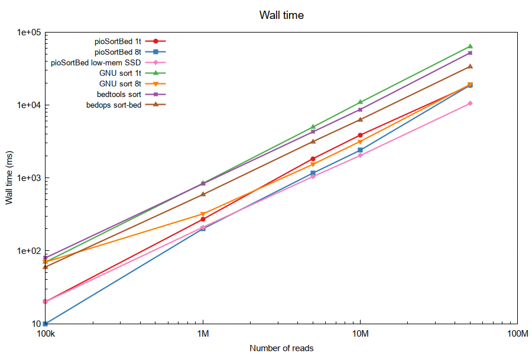
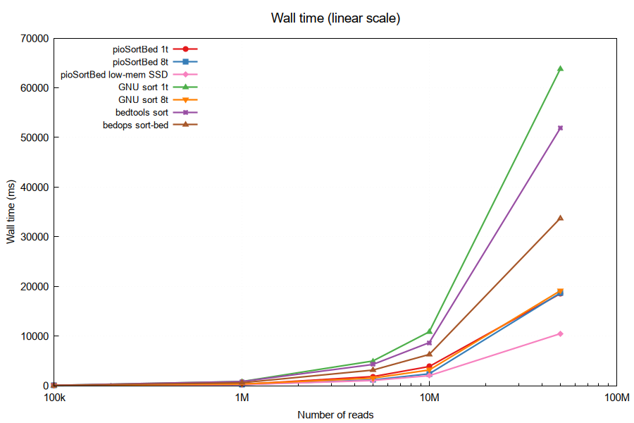
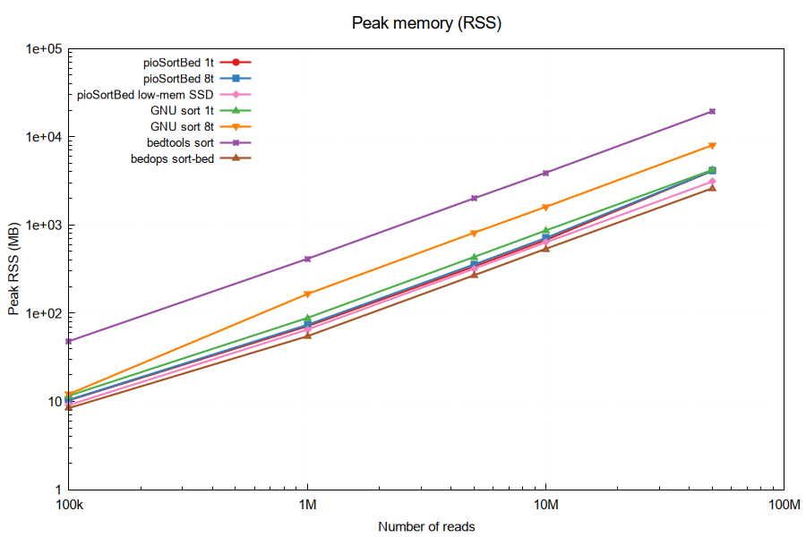
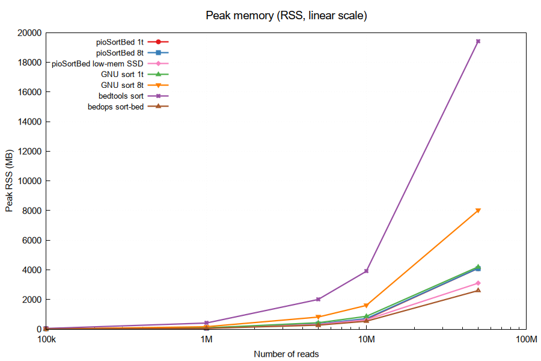

# pioSortBed

**Ultra-fast BED file sorter for genomics**

Sorts BED files by chromosome and start coordinate, equivalent to:
```
LC_ALL=C sort -k1,1 -k2,2n file.bed
```
but significantly faster on large datasets. Supports BED3, BED6, and extended BED formats.

## Algorithm

pioSortBed uses a hybrid sort strategy:
- **Files with < 50M reads** (configurable via `--bucket-cutoff`): classic **O(n log n)** comparison sort (`std::sort` on an index array). Optionally parallel via `--threads`.
- **Files with ≥ 50M reads**: bucket sort (counting sort), which avoids coordinate comparisons entirely — reads are placed directly into position-indexed buckets. This gives **O(n + m)** complexity, where *n* is the number of regions and *m* is the maximum chromosome length.

> Bucket sort has overhead proportional to chromosome length (up to 4 GB allocation), so the classic sort path is preferred for smaller files.

## Installation

**Dependencies:** GCC (no external libraries needed — CLI11 is bundled)

```bash
make
```

Manual compilation:
```bash
g++ src/pioSortBed.cpp -Isrc -o pioSortBed -O3 -std=c++11 -fopenmp -static
```

## Usage

```
pioSortBed [options] <input.bed>
pioSortBed [options] -   # read from standard input
```

| Option | Description |
|--------|-------------|
| `-s s` / `--sort s` | Sort by start coordinate (default) |
| `-s b` / `--sort b` | Sort by start and end coordinate |
| `-s 5` / `--sort 5` | Sort by 5' end (respects strand: col 6) |
| `-r` / `--ral` | Input is in RAL format instead of BED |
| `--collapse` | Collapse overlapping regions, summing weights |
| `--low-mem-ssd` | Low-memory two-pass file mode (SSD-friendly). Slower than default, but lower peak RAM. Requires file input (not stdin). |
| `--bucket-cutoff N` | Use bucket sort for files with ≥N reads (default: 50M; 0 = always bucket sort) |
| `-t N` / `--threads N` | Number of threads for classic sort (0 = all cores; 1 = single-threaded) |
| `-h` / `--help` | Show help message |

**Examples:**
```bash
pioSortBed input.bed > sorted.bed
cat input.bed | pioSortBed - > sorted.bed
pioSortBed --sort b input.bed > sorted.bed
```

## Memory Requirements

All data is loaded into memory. Expect approximately **2× the input file size** in RAM usage.

## Benchmark Results

Comprehensive sorting benchmark on realistic BED6 files (10 chromosomes, coordinates 0–249 Mbp). All tools verified to produce identical sort order.

### System Configuration

**Hardware:**
- CPU: Intel Core Ultra 7 155H (16 cores, P+E architecture)
- RAM: 32 GB
- Storage: SSD (NVME)

**Tools & Command Lines:**

| Tool | Version | Command |
|------|---------|---------|
| **pioSortBed** (v2.0.0) | 2.0.0 | `pioSortBed -t 1 input.bed` (single-thread) |
| **pioSortBed** | 2.0.0 | `pioSortBed -t 8 input.bed` (8 threads) |
| **pioSortBed** (low-mem) | 2.0.0 | `pioSortBed --low-mem-ssd input.bed` (two-pass SSD-friendly mode) |
| **GNU sort** | 9.10 | `LC_ALL=C sort -k1,1 -k2,2n input.bed` (single-thread) |
| **GNU sort** | 9.10 | `LC_ALL=C sort -k1,1 -k2,2n --parallel=8 input.bed` (8 threads) |
| **bedtools** | 2.31.1 | `bedtools sort -i input.bed` |
| **bedops sort-bed** | 2.4.42 | `sort-bed input.bed` |

Wall time and peak RSS (resident set size) measured with GNU time. Times in seconds or milliseconds; memory in MB or GB.


### Wall Time





#### Legend (point style & color):

| Tool                | Color      | Point Style | Description |
|---------------------|------------|-------------|-------------|
| **pioSortBed 1t**   | <span style="color:#e41a1c">████</span> | ●           | Single-thread (default) |
| **pioSortBed 8t**   | <span style="color:#377eb8">████</span> | ■           | 8 threads |
| **pioSortBed low-mem** | <span style="color:#f781bf">████</span> | ◆        | Low-memory SSD mode |
| **GNU sort 1t**     | <span style="color:#4daf4a">████</span> | ▲           | Single-thread |
| **GNU sort 8t**     | <span style="color:#ff7f00">████</span> | ▼           | 8 threads |
| **bedtools**        | <span style="color:#984ea3">████</span> | ✚           | bedtools sort |
| **bedops**          | <span style="color:#a65628">████</span> | ✦           | bedops sort-bed |

| Reads | pio 1t ● | pio 8t ■ | pio low-mem ◆ | sort 1t ▲ | sort 8t ▼ | bedtools ✚ | bedops ✦ |
|------:|----------|----------|---------------|-----------|-----------|------------|-----------|
| 100k  | 20 ms    | 10 ms    | 20 ms         | 70 ms     | 70 ms     | 80 ms      | 60 ms     |
| 1M    | 270 ms   | 200 ms   | 210 ms        | 840 ms    | 320 ms    | 830 ms     | 590 ms    |
| 5M    | 1830 ms  | 1160 ms  | 1040 ms       | 4970 ms   | 1530 ms   | 4270 ms    | 3140 ms   |
| 10M   | 3860 ms  | 2390 ms  | 2020 ms       | 10.85 s   | 3160 ms   | 8670 ms    | 6290 ms   |
| 50M   | 18.53 s  | 18.67 s  | 10.48 s       | 1min03.8s | 19.12 s   | 51.86 s    | 33.73 s   |

**Key observations:**
- **pioSortBed 1t** dominates at moderate sizes (100k–10M reads)
- **pioSortBed low-mem mode** wins on large files (50M+), achieving **2.2–2.8× speedup** over default mode
- **pioSortBed 8t** offers modest speedup at 1M–10M; diminishing returns at 50M+ (thread contention on hybrid strategy)
- **bedops sort-bed** is consistently competitive, especially on very large files; uses low memory
- **GNU sort with parallel threads** can exceed single-threaded if file > 1M

### Peak Memory (RSS)





| Reads | pio 1t ● | pio 8t ■ | pio low-mem ◆ | sort 1t ▲ | sort 8t ▼ | bedtools ✚ | bedops ✦ |
|------:|----------|----------|---------------|-----------|-----------|------------|-----------|
| 100k  | 10.3 MB  | 10.4 MB  | 9.1 MB        | 11.6 MB   | 12.1 MB   | 48.1 MB    | 8.4 MB    |
| 1M    | 71.2 MB  | 73.7 MB  | 65.1 MB       | 88.2 MB   | 164.7 MB  | 412.4 MB   | 54.7 MB   |
| 5M    | 337.8 MB | 355.6 MB | 318.8 MB      | 432.6 MB  | 814.2 MB  | 2.0 GB     | 268.3 MB  |
| 10M   | 674.3 MB | 710.9 MB | 632.8 MB      | 863.6 MB  | 1.6 GB    | 3.9 GB     | 535.4 MB  |
| 50M   | 4.1 GB   | 4.1 GB   | 3.1 GB        | 4.2 GB    | 8.0 GB    | 19.4 GB    | 2.6 GB    |

**Key observations:**
- **pioSortBed low-mem mode** reduces peak RAM on large files (50M: **3.1 GB vs 4.1 GB**; 100M: **6.2 GB vs 7.2 GB**)
- **bedops** achieves lowest memory on small-to-medium files; peaks near pioSortBed on large files
- **GNU sort 8t** uses ~2× memory of single-threaded variant (thread-local buffers)
- **bedtools** memory usage grows rapidly (409.6 MB @ 1M → 24.5 GB @ 100M)

### Performance Summary

**pioSortBed strategy:**
- **Files < 50M reads** (configurable `--bucket-cutoff`): Classic **O(n log n)** comparison sort using an index array
  - Single-threaded std::sort with inlined comparator
  - Optional parallelism via `--threads` (8 threads effective on medium sizes, diminishing on large files)
- **Files ≥ 50M reads**: Bucket/counting sort — O(n + m) complexity where m = max chromosome length
  - Allocates position-indexed buckets (up to 4 GB for human genomes)
  - Excellent scaling on SSD (linear I/O pattern)
- **Low-memory mode** (`--low-mem-ssd`): Two-pass algorithm for RAM-constrained environments
  - Pass 1: Scan file once, store line offsets per chromosome (minimal RAM)
  - Pass 2: Process one chromosome at a time, sorting and printing in isolation
  - Trade-off: **~2.2–2.8× slower** than default mode, but peak RAM ∝ largest chromosome (not whole file)
  - Best for SSD with large genomic files on small-RAM systems

To reproduce: `bash benchmark/benchmark.sh` (requires GNU time; gnuplot for plots).

## Compile-time Limits

These constants can be changed and the program recompiled if needed:

| Constant | Default | Description |
|----------|---------|-------------|
| `lineBufSize` | 1024 bytes | Maximum BED line length (stdin only; no limit for file input) |
| `chrNameBufSize` | 256 bytes | Maximum chromosome name length |
| `chrLenLimit` | 1 Gbp | Maximum chromosome/contig length |
| `defaultBucketCutoff` | 50M | Hybrid sort threshold (overridden by `--bucket-cutoff`) |

## Author

Piotr Balwierz
