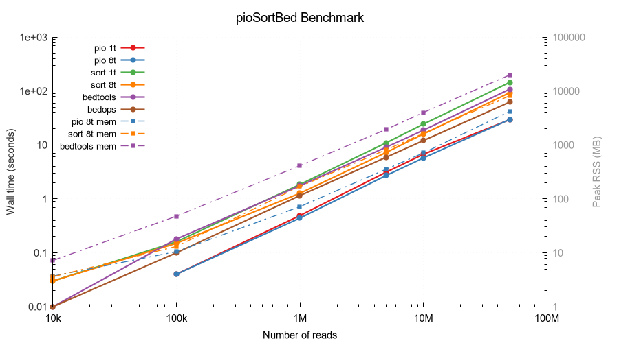

# pioSortBed

**Ultra-fast BED file sorter for genomics**

Sorts BED files by chromosome and start coordinate, equivalent to:
```
LC_ALL=C sort -k1,1 -k2,2n file.bed
```
but significantly faster on large datasets. Supports BED3, BED6, and extended BED formats.

## Algorithm

pioSortBed uses a hybrid sort strategy:
- **Files with < 50M reads** (configurable via `--bucket-cutoff`): classic **O(n log n)** comparison sort (`std::sort` on an index array). Optionally parallel via `--threads`.
- **Files with ≥ 50M reads**: bucket sort (counting sort), which avoids coordinate comparisons entirely — reads are placed directly into position-indexed buckets. This gives **O(n + m)** complexity, where *n* is the number of regions and *m* is the maximum chromosome length.

> Bucket sort has overhead proportional to chromosome length (up to 4 GB allocation), so the classic sort path is preferred for smaller files.

## Installation

**Dependencies:** GCC (no external libraries needed — CLI11 is bundled)

```bash
make
```

Manual compilation:
```bash
g++ pioSortBed.cpp -o pioSortBed -O3 -std=c++11 -fopenmp -static
```

## Usage

```
pioSortBed [options] <input.bed>
pioSortBed [options] -   # read from standard input
```

| Option | Description |
|--------|-------------|
| `-s s` / `--sort s` | Sort by start coordinate (default) |
| `-s b` / `--sort b` | Sort by start and end coordinate |
| `-s 5` / `--sort 5` | Sort by 5' end (respects strand: col 6) |
| `-r` / `--ral` | Input is in RAL format instead of BED |
| `--collapse` | Collapse overlapping regions, summing weights |
| `--bucket-cutoff N` | Use bucket sort for files with ≥N reads (default: 50M; 0 = always bucket sort) |
| `-t N` / `--threads N` | Number of threads for classic sort (0 = all cores; 1 = single-threaded) |
| `-h` / `--help` | Show help message |

**Examples:**
```bash
pioSortBed input.bed > sorted.bed
cat input.bed | pioSortBed - > sorted.bed
pioSortBed --sort b input.bed > sorted.bed
```

## Memory Requirements

All data is loaded into memory. Expect approximately **2× the input file size** in RAM usage.

## Benchmark

Sorting random BED6 files (10 chromosomes, coordinates 0–249 Mbp). Wall time and peak RSS measured with GNU time. All tools verified to produce identical sort order.



Solid lines = wall time (left axis), dashed lines = peak memory (right axis). Log–log scale.

### Wall time

| Reads | pio 1t | pio 8t | sort 1t | sort 8t | bedtools | bedops |
|------:|-------:|-------:|--------:|--------:|---------:|-------:|
| 10k   | < 10 ms | < 10 ms | 30 ms | 30 ms | 10 ms | 10 ms |
| 100k  | **40 ms** | **40 ms** | 160 ms | 150 ms | 180 ms | 100 ms |
| 1M    | 490 ms | **440 ms** | 1.85 s | 1.27 s | 1.75 s | 1.15 s |
| 5M    | 3.13 s | **2.71 s** | 10.97 s | 7.26 s | 9.09 s | 5.92 s |
| 10M   | 6.72 s | **5.75 s** | 24.36 s | 15.97 s | 18.78 s | 12.06 s |
| 50M   | **29.45 s** | 29.71 s | 2min25s | 1min33s | 1min48s | 1min02s |

### Peak memory (RSS)

| Reads | pio 1t | pio 8t | sort 1t | sort 8t | bedtools | bedops |
|------:|-------:|-------:|--------:|--------:|---------:|-------:|
| 10k   | 3.5 MB | 3.7 MB | 3.5 MB | 3.6 MB | 7.2 MB | **2.7 MB** |
| 100k  | **9.9 MB** | 10.5 MB | 12.5 MB | 13.1 MB | 47.8 MB | 11.1 MB |
| 1M    | **70.9 MB** | 71.7 MB | 89.4 MB | 169.4 MB | 412.8 MB | 55.6 MB |
| 5M    | **338.3 MB** | 355.3 MB | 433.6 MB | 816.3 MB | 1.9 GB | 269.2 MB |
| 10M   | **673.9 MB** | 710.3 MB | 864.5 MB | 1.6 GB | 3.9 GB | 536.2 MB |
| 50M   | 4.1 GB | 4.1 GB | 4.2 GB | 8.0 GB | 19.4 GB | **2.6 GB** |

> pioSortBed uses a hybrid strategy: classic sort for < 50M reads, bucket sort above (configurable via `--bucket-cutoff`). At 50M reads the bucket sort kicks in — note the flat time scaling and constant memory. GNU sort 8-thread uses 2× the memory of its single-threaded mode.

Run `bash benchmark.sh` to reproduce (requires GNU time; gnuplot for the plot).

## Compile-time Limits

These constants can be changed and the program recompiled if needed:

| Constant | Default | Description |
|----------|---------|-------------|
| `lineBufSize` | 1024 bytes | Maximum BED line length (stdin only; no limit for file input) |
| `chrNameBufSize` | 256 bytes | Maximum chromosome name length |
| `chrLenLimit` | 1 Gbp | Maximum chromosome/contig length |
| `defaultBucketCutoff` | 50M | Hybrid sort threshold (overridden by `--bucket-cutoff`) |

## Author

Piotr Balwierz
